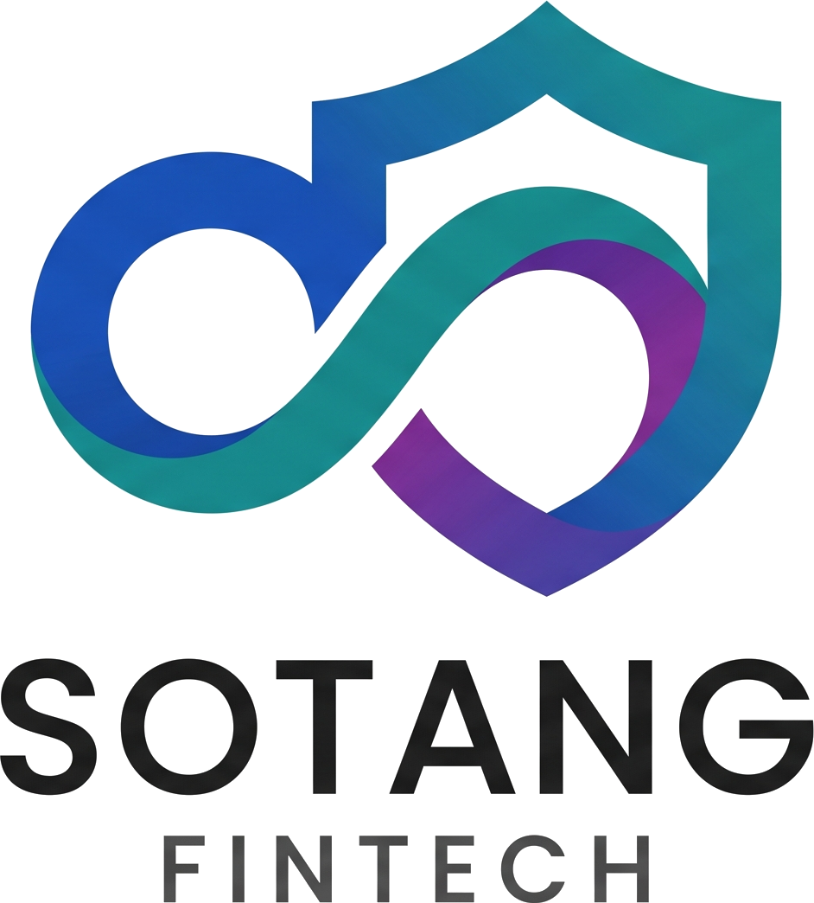

<div align="center">
  
</div>

# 🏗️ Sotang Architecture - Documentación Académica

Repositorio oficial de documentación arquitectónica para el proyecto **Sotang** (Sistema de Finanzas Personales). Este proyecto ha sido estructurado como material de estudio y presentación para la materia de **Arquitectura de Software** (Universidad de Guayaquil).

El sitio de documentación está construido con [VitePress](https://vitepress.dev/), permitiendo una experiencia de lectura moderna, rápida y con soporte integrado para diagramas interactivos.

## 🌟 Características de la Documentación

*   **Arquitectura:** Visión general, despliegue (K3s, Tailscale), y diseño de componentes (FastAPI, React).
*   **Base de Datos:** Modelo Entidad-Relación (ERD) renderizado con Mermaid.js y diccionario de tablas completo.
*   **Patrones de Diseño (GoF):** Aplicación teórica y práctica (con código Python) de 5 patrones de diseño en el módulo de Cuentas.
*   **Interactividad:** 
    *   Diagramas de alto nivel interactivos (IcePanel).
    *   App web embebida para la demostración de patrones de diseño.
    *   Zoom dinámico en diagramas y esquemas.

## 🚀 Instalación y Ejecución Local

Para visualizar este sitio de documentación en tu máquina local, necesitas tener instalado [Node.js](https://nodejs.org/).

1. **Clonar el repositorio:**
   ```bash
   git clone <tu-url-del-repo>
   cd SotangDocWeb
   ```

2. **Instalar dependencias:**
   ```bash
   npm install
   ```

3. **Iniciar el servidor de desarrollo:**
   ```bash
   npm run docs:dev
   ```

4. **Ver el sitio:**
   Abre tu navegador y dirígete a http://localhost:5173

## 🛠️ Construcción para Producción (Build)

Para generar los archivos estáticos HTML/CSS y desplegar el sitio en plataformas como GitHub Pages, Vercel o Netlify:

```bash
npm run docs:build
```
Los archivos generados se encontrarán en el directorio .vitepress/dist.

## 📚 Stack de la Documentación

*   [VitePress](https://vitepress.dev/) - Generador de sitios estáticos.
*   [Mermaid.js](https://mermaid.js.org/) - Diagramas como código (C4, ERD).
*   [Medium-Zoom](https://github.com/francoischalifour/medium-zoom) - Interactividad de imágenes.
*   [IcePanel](https://icepanel.io/) - Modelado C4 interactivo de alto nivel.

---
*Desarrollado por Jefferson Palma para la Universidad de Guayaquil.*