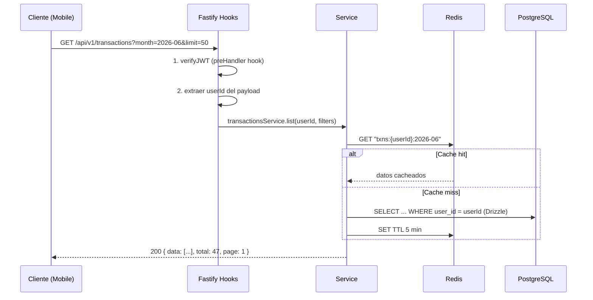
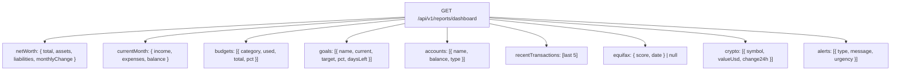
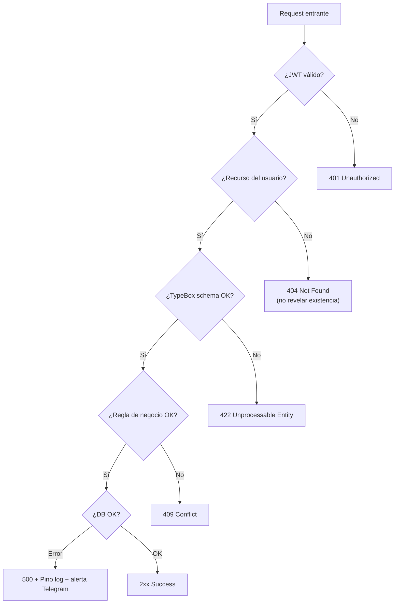

# Diseño de la API REST

<p class="section-intro">REST API versionada en <code>/api/v1</code>. Fastify genera automáticamente una especificación <strong>OpenAPI 3.0</strong> desde los schemas TypeBox, disponible en <code>GET /documentation/json</code>.</p>

**Base URL:** `https://sotang.example.com/api/v1`

## Endpoints por módulo

| Módulo | Endpoints principales |
|--------|----------------------|
| `/auth` | POST login · register · refresh · logout · forgot-password · reset-password |
| `/accounts` | GET/POST / · GET/PATCH/DELETE /{id} · GET /{id}/balance · GET /summary · GET/POST /groups |
| `/transactions` | GET/POST / · GET/PATCH/DELETE /{id} · GET/POST /recurring · GET/POST/PATCH/DELETE /categories |
| `/budgets` | GET/POST / · GET/PATCH/DELETE /{id} · GET /current-status |
| `/goals` | GET/POST / · GET/PATCH/DELETE /{id} · POST /{id}/contributions |
| `/patrimony` | GET/POST /assets · GET/POST /liabilities · GET /net-worth · POST /equifax/upload |
| `/receivables` | GET/POST / · GET/PATCH /{id} · POST /{id}/payments · GET/POST /debts |
| `/reports` | POST /monthly (PDF) · POST /export (Excel) · GET /dashboard · GET /cashflow |
| `/notifications` | GET/PATCH /preferences · GET /history |
| `/storage` | POST /upload · GET/DELETE /{filename} |
| `/backup` | POST /trigger · GET /history |
| `/users/me` | GET/PATCH /settings · PATCH /profile · POST /fcm-token · POST /telegram/link |
| `/health` | GET / · GET /ready |

## Flujo de request/response



## Estructura de respuestas

| Caso | HTTP | Body |
|------|------|------|
| Item único | 200 | `{ data: {...} }` |
| Colección paginada | 200 | `{ data: [...], total: N, page: P, limit: L }` |
| Creación | 201 | `{ data: {...} }` |
| Eliminación | 204 | — |
| Validación | 422 | `{ error: "validation_error", detail: [...] }` |
| No autenticado | 401 | `{ error: "token_expired" }` |
| No encontrado | 404 | `{ error: "not_found", resource: "transaction" }` |
| Error interno | 500 | `{ error: "internal_error", requestId: "..." }` |

## Dashboard — respuesta consolidada



Una sola llamada para alimentar el Dashboard completo.

## Árbol de decisión de errores



## Rate limiting y caché

| Endpoint | Cache TTL | Rate limit |
|----------|-----------|------------|
| `GET /transactions` | 5 min | 60 req/min |
| `GET /reports/dashboard` | 5 min | 30 req/min |
| `POST /transactions` | Sin caché | 30 req/min |
| `POST /auth/login` | Sin caché | **10 req/min** |
| `POST /auth/register` | Sin caché | **5 req/min** |
| `POST /reports/monthly` | N/A (async BullMQ) | 5 req/min |

## OpenAPI — auto-generación Fastify

```typescript
await fastify.register(require('@fastify/swagger'), {
  openapi: {
    info: { title: 'Sotang API', version: '1.0.0' },
    components: {
      securitySchemes: {
        bearerAuth: { type: 'http', scheme: 'bearer', bearerFormat: 'JWT' }
      }
    }
  }
});
await fastify.register(require('@fastify/swagger-ui'), {
  routePrefix: '/documentation'
});
```

Disponible en `GET /documentation` (Swagger UI) y `GET /documentation/json` (spec OpenAPI 3.0).
