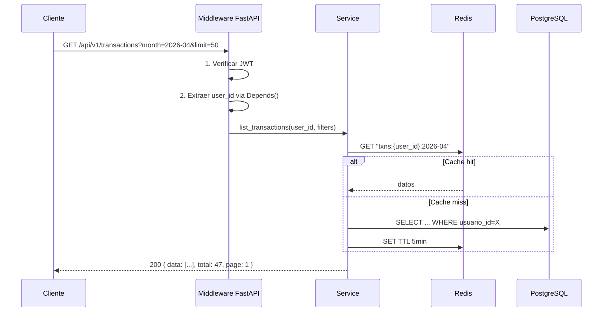
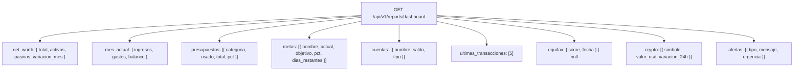
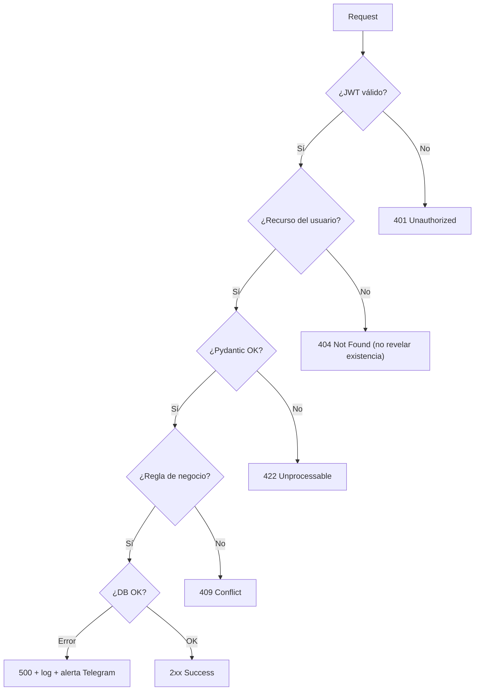

# Diseño de la API REST

**Base URL:** `https://sotang.domain.com/api/v1`

## Endpoints por módulo

| Módulo               | Endpoints principales                                                                                          |
| -------------------- | -------------------------------------------------------------------------------------------------------------- |
| `/auth`              | POST login · register · refresh · logout · forgot-password · reset-password · verify-email                     |
| `/accounts`          | GET/POST / · GET/PATCH/DELETE /{id} · GET /{id}/balance · GET /summary · GET/POST /groups                      |
| `/transactions`      | GET/POST / · GET/PATCH/DELETE /{id} · GET/POST /recurring · GET/POST/PATCH/DELETE /categories · GET/POST /tags |
| `/budgets`           | GET/POST / · GET/PATCH/DELETE /{id} · GET /current-status                                                      |
| `/goals`             | GET/POST / · GET/PATCH/DELETE /{id} · POST /{id}/contributions                                                 |
| `/patrimony`         | GET/POST /assets · GET/POST /liabilities · GET /net-worth · POST /equifax/upload · GET /equifax/latest         |
| `/receivables`       | GET/POST / · GET/PATCH /{id} · POST /{id}/payments · GET/POST /debts · POST /debts/{id}/payments               |
| `/reports`           | POST /monthly (PDF) · POST /export (Excel) · GET /dashboard · GET /cashflow                                    |
| `/notifications`     | GET/PATCH /preferences · GET/GET-id /history                                                                   |
| `/storage`           | POST /upload · GET/DELETE /{filename}                                                                          |
| `/backup`            | POST /trigger · GET /history                                                                                   |
| `/users/me/settings` | GET/PATCH / · PATCH /profile · POST /avatar · POST /telegram/link · POST /fcm-token                            |
| `/health`            | GET / · GET /ready                                                                                             |

## Patrones de request/response

## Estructura de respuestas

| Caso               | HTTP | Body                                              |
| ------------------ | ---- | ------------------------------------------------- |
| Item único         | 200  | `{ data: {...} }`                                 |
| Colección paginada | 200  | `{ data: [...], total: N, page: P, limit: L }`    |
| Creación           | 201  | `{ data: {...} }`                                 |
| Eliminación        | 204  | —                                                 |
| Validación         | 422  | `{ error: "validation_error", detail: [...] }`    |
| No autenticado     | 401  | `{ error: "token_expired" }`                      |
| No encontrado      | 404  | `{ error: "not_found", resource: "transaction" }` |
| Error interno      | 500  | `{ error: "internal_error", request_id: "..." }`  |

## Dashboard — respuesta consolidada

Todo en **una sola llamada** para el dashboard.

## Árbol de decisión de errores

## Rate limiting y caché

| Endpoint                 | Cache TTL   | Rate limit     |
| ------------------------ | ----------- | -------------- |
| `GET /transactions`      | 5 min       | 60 req/min     |
| `GET /reports/dashboard` | 5 min       | 30 req/min     |
| `POST /transactions`     | Sin cache   | 30 req/min     |
| `POST /auth/login`       | Sin cache   | **10 req/min** |
| `POST /auth/register`    | Sin cache   | **5 req/min**  |
| `POST /reports/monthly`  | N/A (async) | 5 req/min      |

## Autenticación de canales

| Canal              | Mecanismo                                            |
| ------------------ | ---------------------------------------------------- |
| Browser / frontend | `Authorization: Bearer {access_token}`               |
| Telegram Bot → API | `X-Internal-Key: {SECRET}` (solo red interna K3s)    |
| Endpoints públicos | Sin auth: `/auth/login`, `/auth/register`, `/health` |
