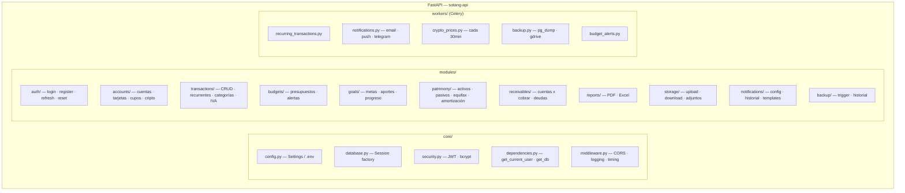
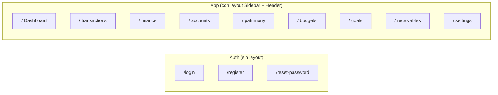
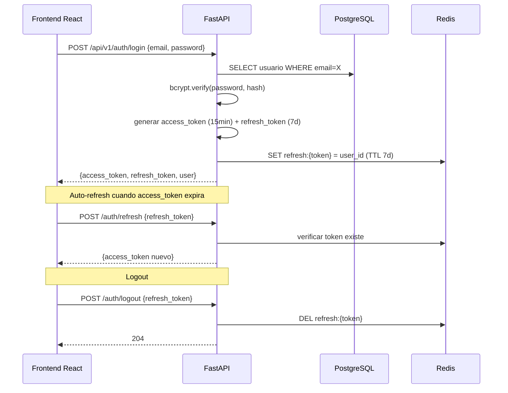
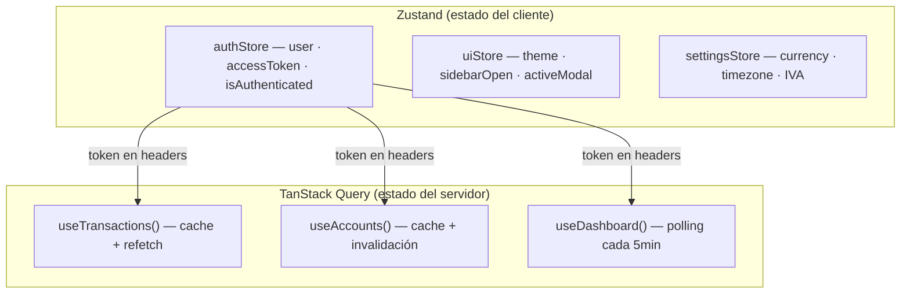

# Componentes — Backend y Frontend

## Módulos del backend (Monolito Modular)



Cada módulo tiene: `router.py` · `service.py` · `schemas.py` · `models.py`

## Estructura de carpetas del backend

```
sotang-api/app/
├── core/
│   ├── config.py          pydantic-settings
│   ├── database.py        SQLAlchemy engine + session
│   ├── security.py        JWT, bcrypt, tokens
│   └── dependencies.py    FastAPI Depends()
├── modules/
│   ├── auth/
│   ├── accounts/
│   ├── transactions/
│   ├── budgets/
│   ├── goals/
│   ├── patrimony/
│   ├── receivables/
│   ├── reports/
│   ├── storage/
│   ├── notifications/
│   └── backup/
├── workers/
│   ├── celery_app.py
│   ├── recurring_transactions.py
│   ├── notifications.py
│   ├── crypto_prices.py
│   ├── backup.py
│   └── budget_alerts.py
├── integrations/
│   ├── resend_client.py
│   ├── firebase_client.py
│   ├── telegram_client.py
│   ├── coingecko_client.py
│   └── gdrive_client.py
└── main.py
```

## Navegación del frontend



## Flujo de autenticación JWT



## Estado global del frontend


