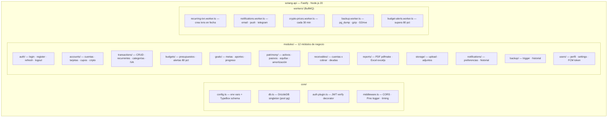
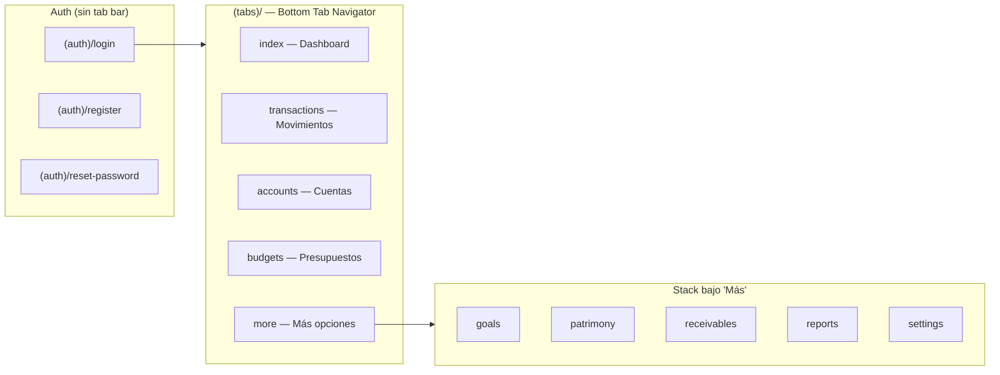
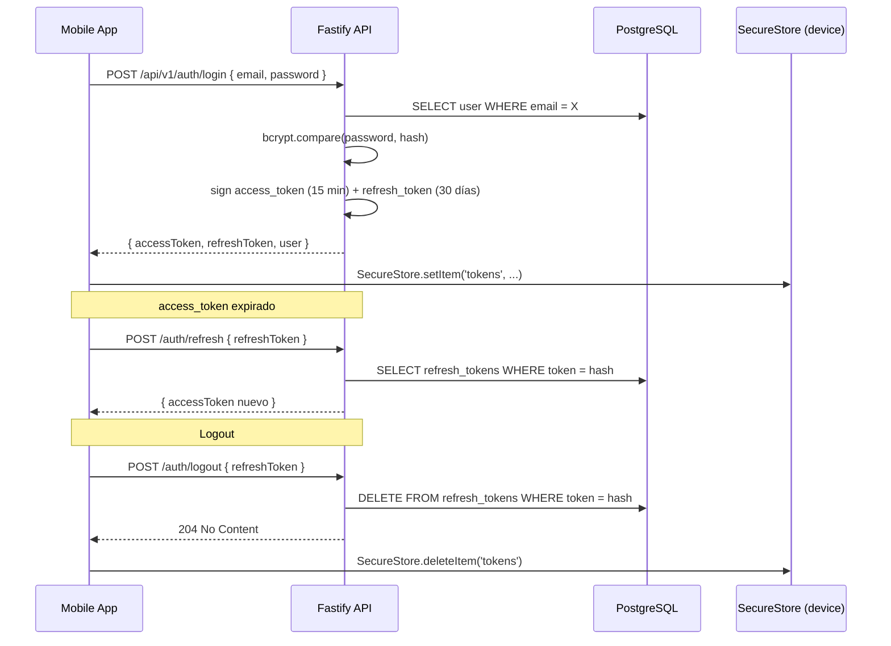
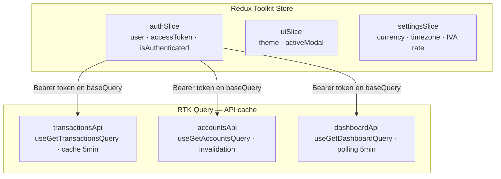

# Componentes — Backend y Clientes

<p class="section-intro">El backend es un <strong>Monolito Modular</strong> Fastify con 12 módulos de negocio independientes. Tres clientes consumen el mismo REST API: la app mobile React Native, el bot Telegram, y la SPA web (Fase 2).</p>

## Módulos del backend



Cada módulo contiene: `router.ts` · `service.ts` · `schema.ts` (TypeBox) · `repository.ts` (Drizzle)

## Estructura de carpetas

```
sotang-api/src/
├── core/
│   ├── config.ts          TypeBox env schema + dotenv
│   ├── db.ts              DrizzleDB pool singleton
│   ├── auth.plugin.ts     Fastify decorator: verifyJWT
│   └── middleware.ts      CORS, Pino, timing
├── modules/
│   ├── auth/
│   ├── accounts/
│   ├── transactions/
│   ├── budgets/
│   ├── goals/
│   ├── patrimony/
│   ├── receivables/
│   ├── reports/
│   ├── storage/
│   ├── notifications/
│   ├── backup/
│   └── users/
├── workers/
│   ├── queues.ts              BullMQ Queue instances
│   ├── recurring-txn.worker.ts
│   ├── notifications.worker.ts
│   ├── crypto-prices.worker.ts
│   ├── backup.worker.ts
│   └── budget-alerts.worker.ts
├── integrations/
│   ├── resend.adapter.ts
│   ├── firebase.adapter.ts
│   ├── telegram.adapter.ts
│   ├── coingecko.adapter.ts
│   └── gdrive.adapter.ts
└── app.ts
```

## Navegación mobile (React Native + Expo Router)



## Flujo de autenticación JWT



## Estado global mobile (Redux Toolkit)


