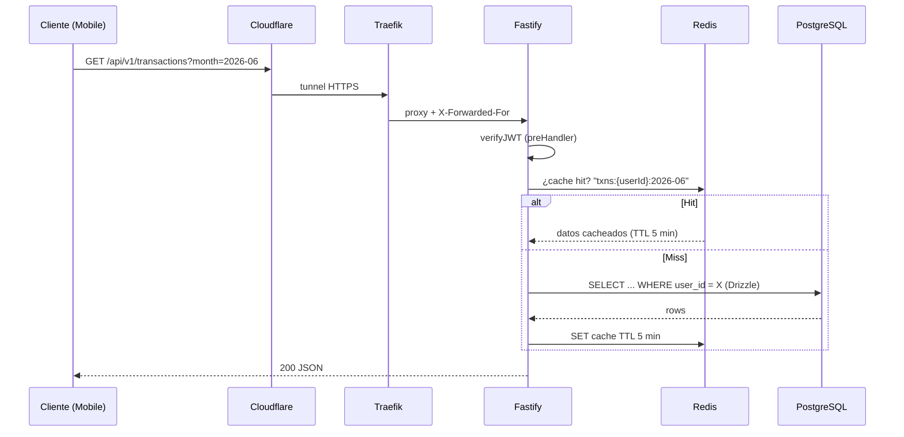
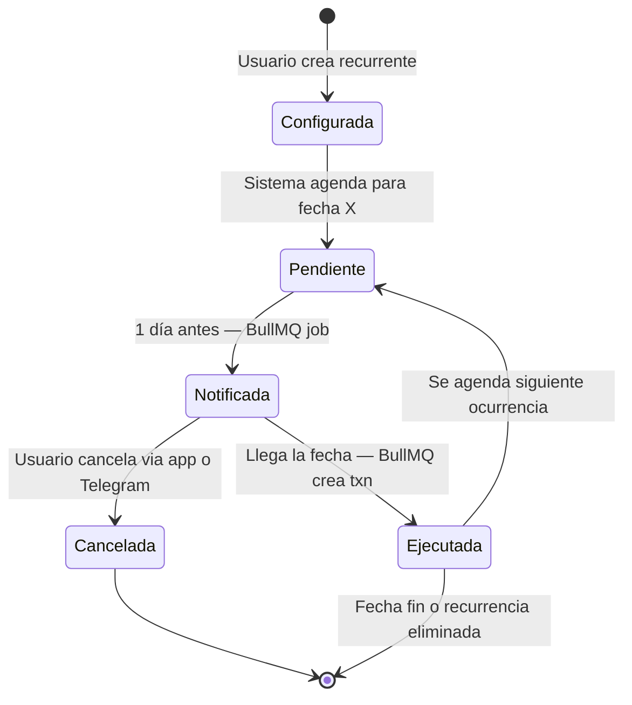
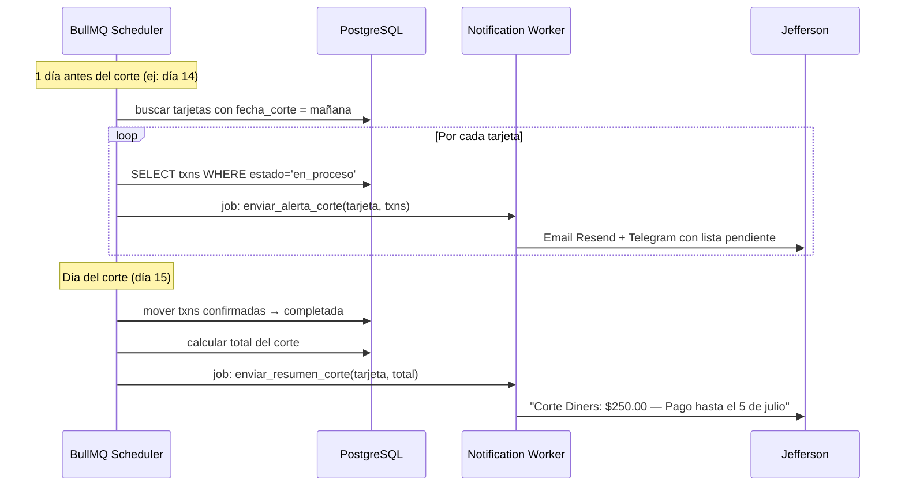
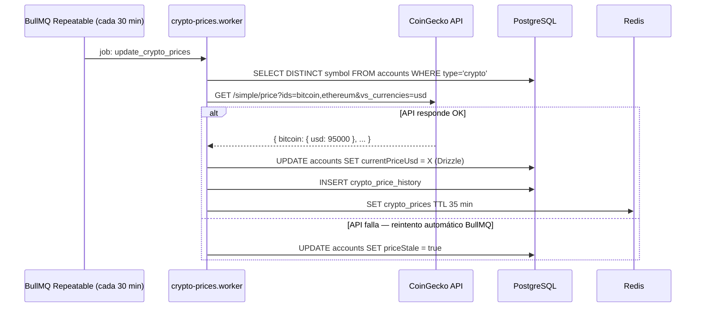
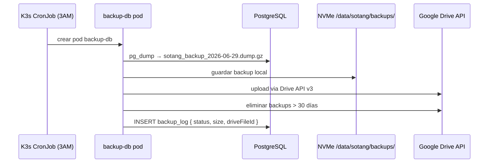
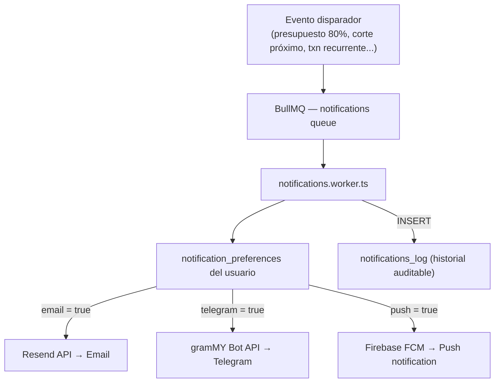
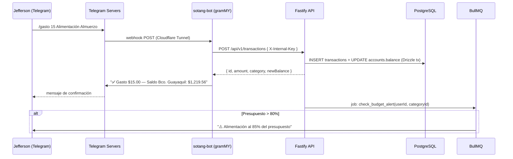
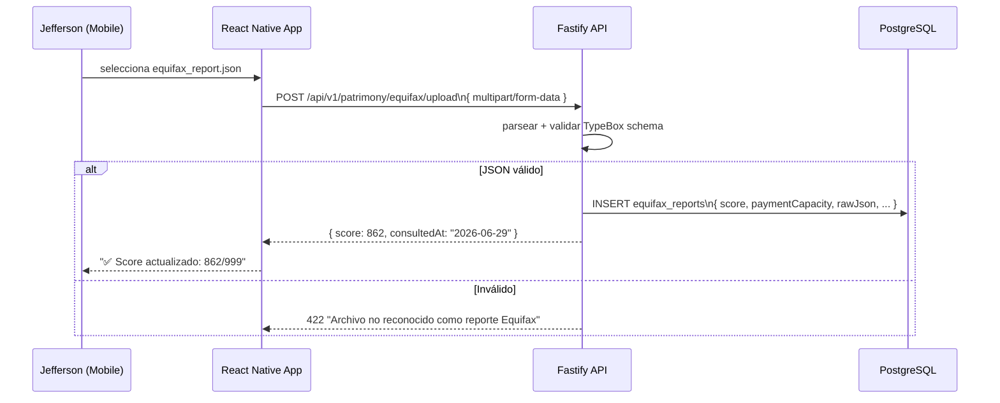

# Flujos de Datos Clave

Los flujos más importantes del sistema: desde un request HTTP hasta las tareas asíncronas BullMQ que manejan notificaciones, transacciones recurrentes y backups.

## 1. Request HTTP general

## 2. Ciclo de vida de transacciones recurrentes

## 3. Corte de tarjeta de crédito

## 4. Actualización de precios cripto

## 5. Backup automático

## 6. Notificaciones multi-canal

## 7. Transacción rápida desde Telegram

## 8. Upload de reporte Equifax

