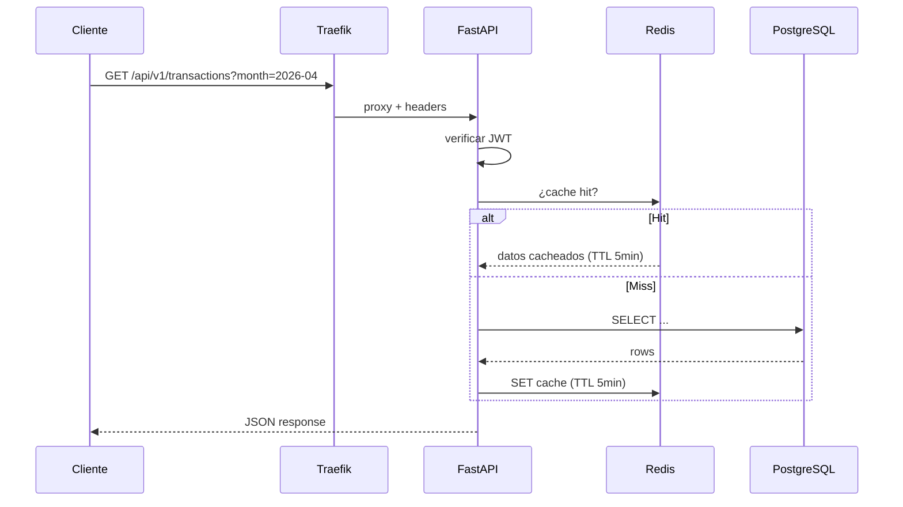
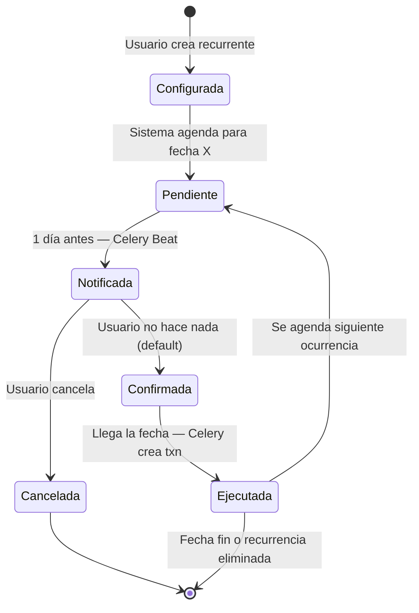
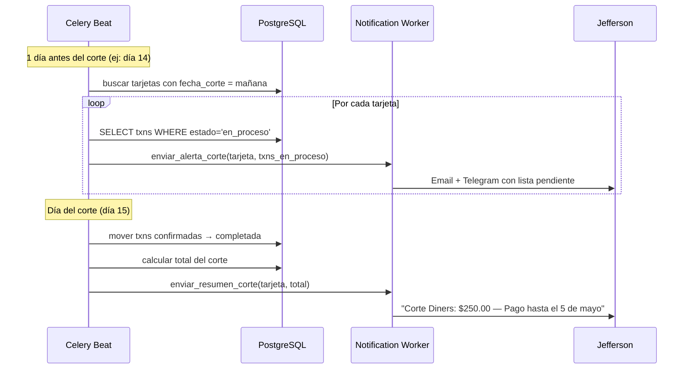
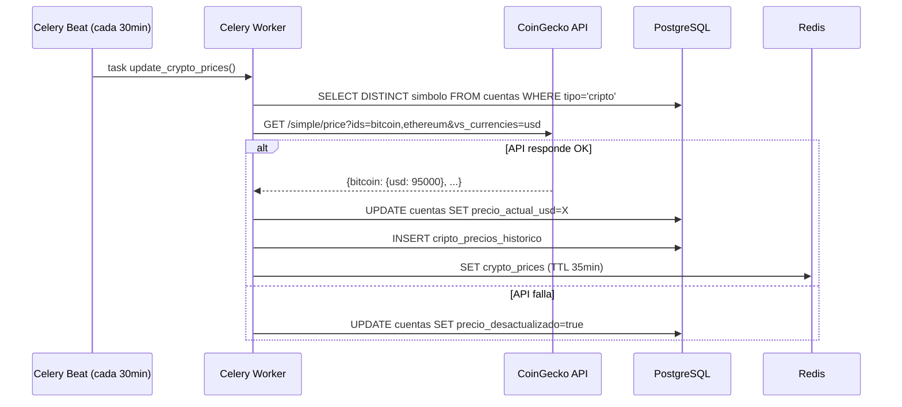
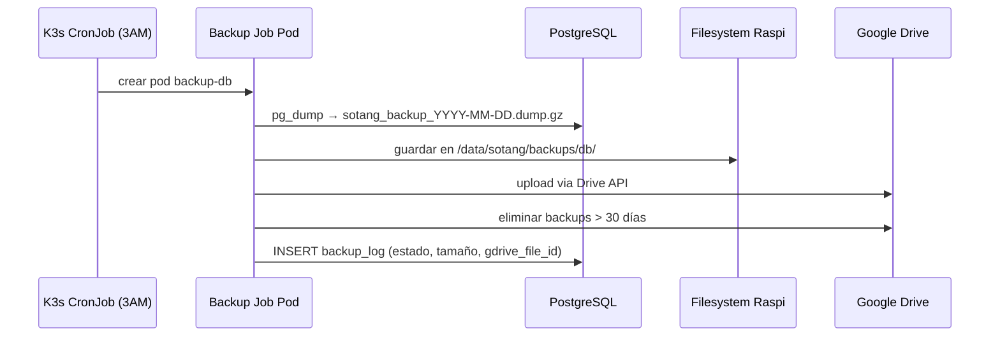
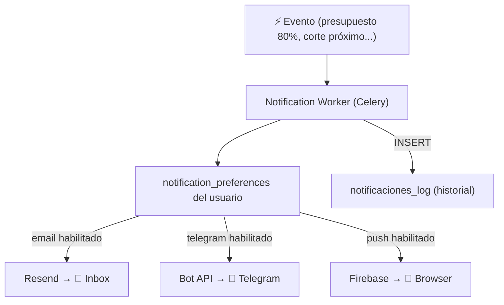
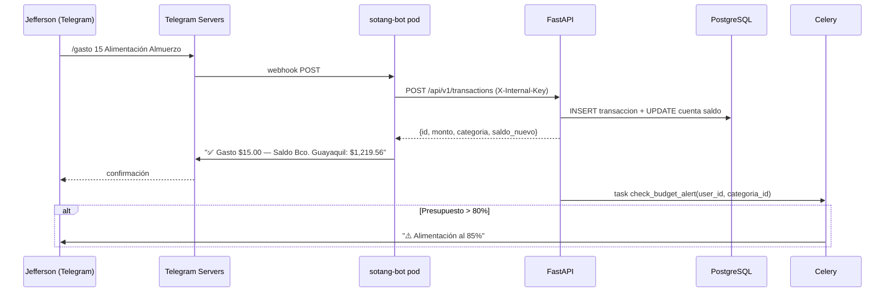
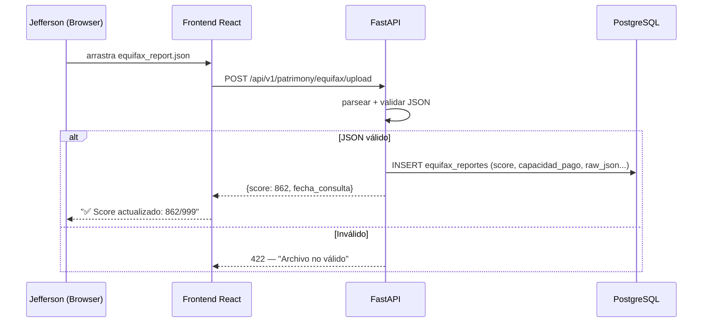

# Flujos de Datos Clave

## 1. Request HTTP general

## 2. Ciclo de vida de transacciones recurrentes

## 3. Corte de tarjeta de crédito

## 4. Actualización de precios cripto

## 5. Backup automático

## 6. Notificaciones multi-canal

## 7. Transacción desde Telegram

## 8. Upload de JSON de Equifax

