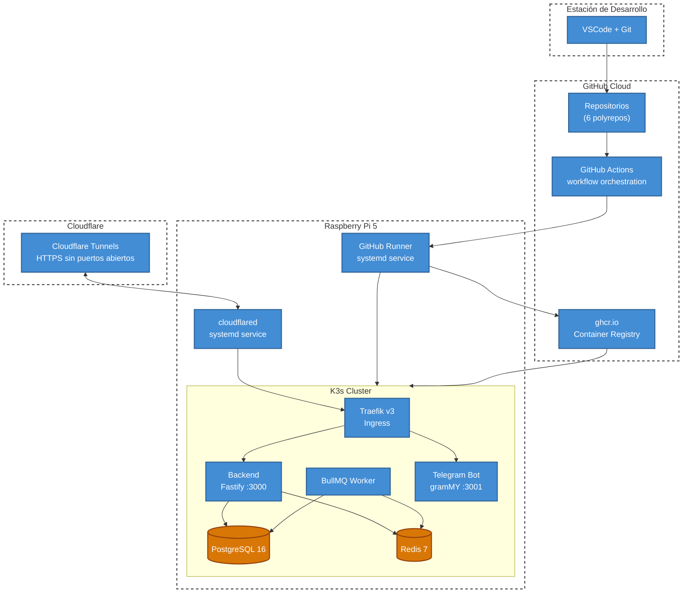
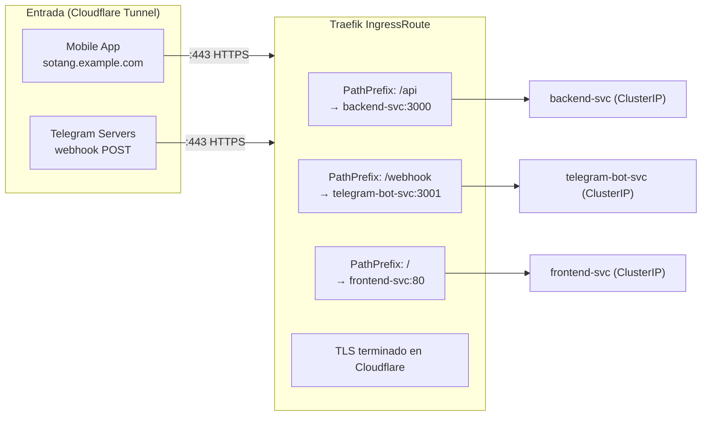
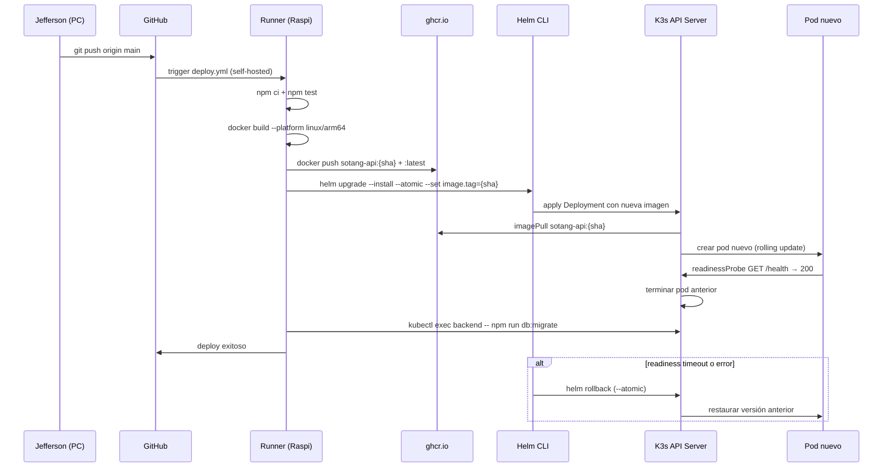

# Arquitectura — Despliegue

Un push a <code>main</code> dispara el pipeline en el self-hosted runner de la Raspi. Helm gestiona el rollout con <code>--atomic</code>: si el pod no pasa el readiness check, hace rollback automático.

## C4 Deployment — Capas de infraestructura

## Diagrama de despliegue completo

```mermaid
graph TB
    classDef pod fill:#052e16,stroke:#16a34a,color:#bbf7d0
    classDef db fill:#1c1917,stroke:#d97706,color:#fde68a
    classDef worker fill:#1e1b4b,stroke:#7c3aed,color:#ddd6fe
    classDef infra fill:#0f172a,stroke:#6366f1,color:#c7d2fe
    classDef cfg fill:#450a0a,stroke:#dc2626,color:#fca5a5
    classDef fs fill:#0c0a09,stroke:#78716c,color:#d6d3d1
    classDef boundary fill:none,stroke:#444444,stroke-width:2px,stroke-dasharray: 5 5

    subgraph RASPI["Raspberry Pi 5 — Ubuntu Server 24.04 arm64 — 8 GB RAM / NVMe SSD"]

        subgraph SYSTEMD["Servicios systemd"]
            CF_D["cloudflared.service\ntúnel sotang.example.com → Traefik"]:::infra
            RUNNER["actions.runner.service\nCI/CD ARM64 self-hosted"]:::infra
        end

        subgraph K3S["K3s v1.30 — Single Node Cluster"]

            subgraph KUBE_SYS["namespace: kube-system"]
                TRAEFIK_POD["Pod: traefik\nTraefik v3 · :80 :443\nIngressRoute CRD"]:::infra
                COREDNS_POD["Pod: coredns\nDNS interno K3s"]:::infra
            end

            subgraph SOTANG_NS["namespace: sotang"]

                subgraph DEPLOYMENTS["Deployments — rolling update · self-healing"]
                    FE["Pod: frontend\nsotang-web:sha\nNginx · React SPA (Fase 2)"]:::pod
                    BE["Pod: backend\nsotang-api:sha\nFastify · :3000\n12 módulos · TypeBox"]:::pod
                    WK["Pod: bullmq-worker\nsotang-api:sha\nBullMQ workers · concurrency=4"]:::worker
                    BOT["Pod: telegram-bot\nsotang-bot:sha\ngramMY · :3001\n/gasto /ingreso /balance"]:::pod
                end

                subgraph STATEFULSETS["StatefulSets — identidad estable · PVC propio"]
                    PG["Pod: postgres-0\npostgres:16\n:5432 · WAL habilitado"]:::db
                    REDIS["Pod: redis-0\nredis:7-alpine\n:6379 · broker BullMQ"]:::db
                end

                subgraph CRONJOBS["CronJobs"]
                    BK_JOB["Job: backup-db\nschedule: 0 3 * * *\npg_dump → gzip → GDrive"]:::worker
                    EX_JOB["Job: data-export\nschedule: 0 4 * * 0\nCSV + JSON → zip → GDrive"]:::worker
                end

                subgraph STORAGE_K8S["PersistentVolumeClaims (hostPath NVMe)"]
                    PVC_PG["postgres-pvc · 5 Gi"]:::fs
                    PVC_ST["storage-pvc · 20 Gi"]:::fs
                    PVC_BK["backup-pvc · 10 Gi"]:::fs
                end

                subgraph CONFIG["ConfigMap + Secrets"]
                    CM["sotang-config\nAPP_ENV · DATABASE_URL · REDIS_URL"]:::cfg
                    SEC["sotang-secrets\nJWT_SECRET · RESEND_KEY\nTELEGRAM_TOKEN · FIREBASE_KEY\nGDRIVE_SA_JSON"]:::cfg
                    GSEC["ghcr-secret\ndocker-registry credentials"]:::cfg
                end
            end
        end

        subgraph FS["Filesystem: /data/sotang/ (NVMe)"]
            FS_PG["/postgres/ — WAL + data"]:::fs
            FS_ST["/storage/{año}/{mes}/ — adjuntos"]:::fs
            FS_BK["/backups/ — dumps locales"]:::fs
        end
    end

    subgraph EXTERNAL["Servicios externos"]
        CF_NET["Cloudflare Network"]:::infra
        GHCR["ghcr.io — Container Registry"]:::infra
        GH_ACTIONS["GitHub Actions"]:::infra
        RESEND["Resend API"]
        FCM["Firebase FCM"]
        TG_API["Telegram Bot API"]
        GECKO["CoinGecko API"]
        GDRIVE["Google Drive API"]
    end

    INTERNET(["Internet\n(Jeff — mobile + Telegram)"]) -->|"HTTPS"| CF_NET
    CF_NET <-->|"túnel"| CF_D --> TRAEFIK_POD

    TRAEFIK_POD -->|"Host: sotang.example.com /api"| BE
    TRAEFIK_POD -->|"Host: sotang.example.com /webhook"| BOT
    TRAEFIK_POD -->|"Host: sotang.example.com /"| FE

    BE -->|"postgres-svc:5432"| PG
    BE -->|"redis-svc:6379"| REDIS
    WK -->|"redis-svc:6379"| REDIS
    WK -->|"postgres-svc:5432"| PG
    BOT -->|"http://backend-svc:3000"| BE

    PG --> PVC_PG --> FS_PG
    BE --> PVC_ST --> FS_ST
    BK_JOB --> PVC_BK --> FS_BK

    RUNNER -->|"helm upgrade + docker push"| GHCR
    GH_ACTIONS -->|"notify runner"| RUNNER
    GHCR -->|"imagePull"| FE & BE & WK & BOT & BK_JOB

    WK -->|"adapters"| RESEND & FCM & TG_API & GECKO
    BK_JOB & EX_JOB -->|"Drive API v3"| GDRIVE

    SEC -.->|"env vars"| BE & WK & BOT & BK_JOB
    CM -.->|"env vars"| BE & WK
    GSEC -.->|"imagePullSecrets"| DEPLOYMENTS & STATEFULSETS & CRONJOBS
```

## Traefik — Routing rules

## Ciclo de vida de un deploy

## Decisiones clave

| Decisión | Motivo |
|----------|--------|
| **Runner fuera del cluster** | El runner necesita Docker daemon — K3s usa containerd, no Docker. Corre como systemd service en el host. |
| **StatefulSets para Postgres y Redis** | Identidad de pod estable (`postgres-0`) + PVC propio. Necesario para datos persistentes. |
| **hostPath para PVCs** | Single-node cluster — no hay necesidad de NFS. Más simple, máximo throughput directo al NVMe. |
| **Helm `--atomic`** | Si el deploy falla (readiness timeout, imagen corrupta), Helm hace rollback automático. |
| **Cloudflare Tunnels** | No hay puertos públicos expuestos. TLS terminado en Cloudflare. Telegram Webhooks funcionan sin IP pública. |
| **Namespace único `sotang`** | Un solo usuario, un solo entorno. Sin necesidad de separar por ambiente en K3s. |
