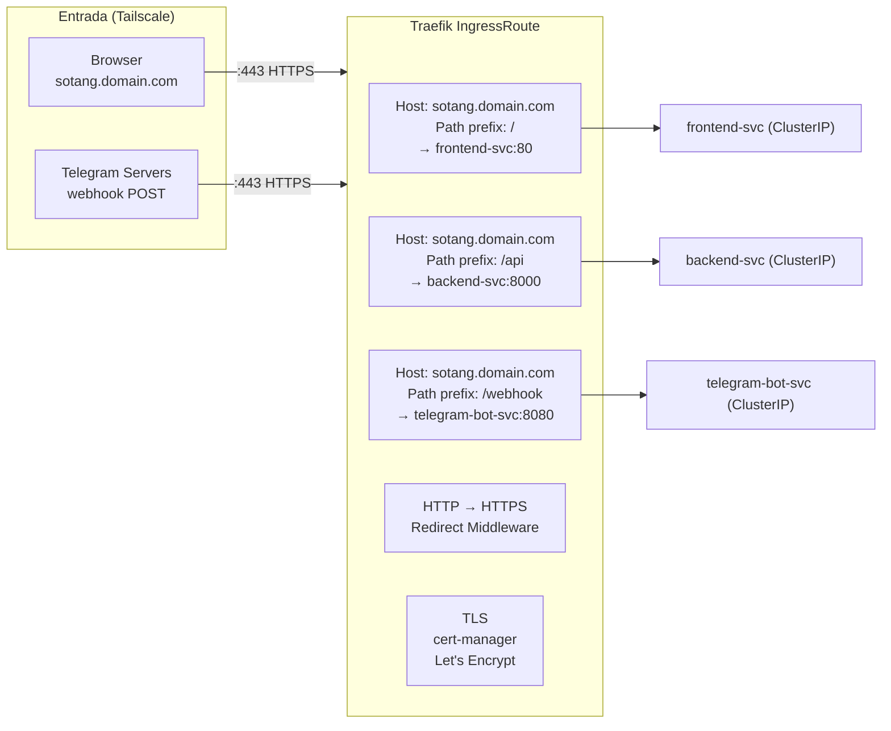
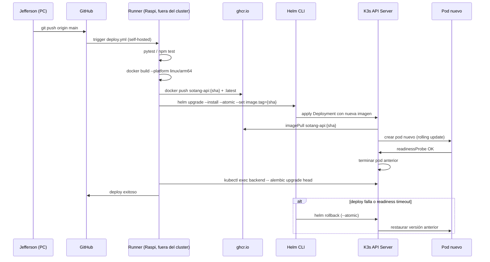

# Arquitectura — Despliegue (Deployment)


## C4 Deployment — Capas de infraestructura

```mermaid
C4Deployment
    title Sotang — Deployment Diagram

    Deployment_Node(dev, "Desarrollador", "Windows 11") {
        Container(vscode, "VSCode + Git", "IDE", "Escribe código y hace push")
    }

    Deployment_Node(cloud, "GitHub Cloud", "github.com") {
        Deployment_Node(ghrepos, "Repositorios", "Polyrepo") {
            Container(repo_api, "sotang-api", "Git repo", "FastAPI + Celery + Helm chart")
            Container(repo_web, "sotang-web", "Git repo", "React + Nginx + Helm chart")
            Container(repo_bot, "sotang-bot", "Git repo", "Telegram Bot + Helm chart")
        }
        Deployment_Node(ghcr, "GitHub Container Registry", "ghcr.io/jeff") {
            Container(img_api, "sotang-api:latest", "Docker image", "arm64")
            Container(img_web, "sotang-web:latest", "Docker image", "arm64")
            Container(img_bot, "sotang-bot:latest", "Docker image", "arm64")
        }
    }

    Deployment_Node(raspi, "Raspberry Pi 5", "Ubuntu Server 24.04 LTS — arm64 — 8GB RAM") {

        Deployment_Node(system_services, "Servicios del sistema", "systemd") {
            Container(tailscale_svc, "Tailscale Agent", "WireGuard", "IP: 100.73.218.19 — túnel VPN")
            Container(gh_runner, "GitHub Actions Runner", "self-hosted arm64", "Ejecuta pipelines CI/CD")
        }

        Deployment_Node(k3s_node, "K3s Node", "Kubernetes v1.34 — single node") {

            Deployment_Node(ns_system, "kube-system", "namespace — K3s built-ins") {
                Container(traefik, "Traefik v3", "Pod — Deployment", "Ingress controller · :80 :443 · TLS termination")
                Container(coredns, "CoreDNS", "Pod — Deployment", "DNS interno del cluster")
                Container(servicelb, "ServiceLB", "DaemonSet", "Load balancer integrado")
            }

            Deployment_Node(ns_sotang, "sotang", "namespace — aplicación") {

                Deployment_Node(deploy_group, "Deployments — stateless", "") {
                    Container(pod_fe, "frontend", "Pod · Image: sotang-web", "Nginx sirviendo React SPA · :80")
                    Container(pod_be, "backend", "Pod · Image: sotang-api", "FastAPI · Uvicorn · :8000")
                    Container(pod_worker, "celery-worker", "Pod · Image: sotang-api", "Celery · consume tasks de Redis")
                    Container(pod_beat, "celery-beat", "Pod · Image: sotang-api", "Celery Beat · scheduler de tareas")
                    Container(pod_bot, "telegram-bot", "Pod · Image: sotang-bot", "python-telegram-bot · :8080")
                }

                Deployment_Node(stateful_group, "StatefulSets — stateful", "") {
                    ContainerDb(pod_pg, "postgres", "Pod · Image: postgres:16", "PostgreSQL · :5432 · 26 tablas")
                    ContainerDb(pod_redis, "redis", "Pod · Image: redis:7-alpine", "Redis · :6379 · broker + cache")
                }

                Deployment_Node(cron_group, "CronJobs — batch", "") {
                    Container(job_backup, "backup-db", "Job · Image: sotang-api", "pg_dump → Drive · schedule: 0 3 * * *")
                    Container(job_export, "data-export", "Job · Image: sotang-api", "CSV/JSON export → Drive · schedule: 0 4 * * 0")
                }

                Deployment_Node(config_group, "Config & Secrets", "") {
                    Container(configmap, "sotang-config", "ConfigMap", "APP_ENV · DOMAIN · CELERY_BROKER_URL")
                    Container(secrets, "sotang-secrets", "Secret", "DB_PASSWORD · JWT_SECRET · RESEND_KEY · TELEGRAM_TOKEN · FIREBASE_KEY · GDRIVE_SA_JSON")
                    Container(ghcr_secret, "ghcr-secret", "Secret (docker-registry)", "Credenciales para pull de imágenes")
                }

                Deployment_Node(pvc_group, "PersistentVolumeClaims", "") {
                    ContainerDb(pvc_pg, "postgres-pvc", "PVC · 5Gi · hostPath", "/data/sotang/postgres/")
                    ContainerDb(pvc_storage, "storage-pvc", "PVC · 20Gi · hostPath", "/data/sotang/storage/")
                    ContainerDb(pvc_backup, "backup-pvc", "PVC · 10Gi · hostPath", "/data/sotang/backups/")
                }
            }
        }

        Deployment_Node(filesystem, "Filesystem local", "/data/sotang/ — NVMe SSD") {
            ContainerDb(fs_pg, "postgres/", "Datos PostgreSQL", "WAL · tablas · índices")
            ContainerDb(fs_storage, "storage/", "Adjuntos de usuarios", "{user_id}/adjuntos/{año}/{mes}/")
            ContainerDb(fs_backups, "backups/", "Backups locales", "db/ · exports/")
        }
    }

    Rel(vscode, repo_api, "git push main")
    Rel(vscode, repo_web, "git push main")
    Rel(vscode, repo_bot, "git push main")
    Rel(repo_api, gh_runner, "trigger workflow")
    Rel(repo_web, gh_runner, "trigger workflow")
    Rel(repo_bot, gh_runner, "trigger workflow")
    Rel(gh_runner, img_api, "docker build + push")
    Rel(gh_runner, img_web, "docker build + push")
    Rel(gh_runner, img_bot, "docker build + push")
    Rel(gh_runner, k3s_node, "helm upgrade --install --atomic")
    Rel(img_api, pod_be, "imagePull")
    Rel(img_web, pod_fe, "imagePull")
    Rel(img_bot, pod_bot, "imagePull")
    Rel(tailscale_svc, traefik, "enruta tráfico entrante")
    Rel(traefik, pod_fe, "/ → frontend:80")
    Rel(traefik, pod_be, "/api → backend:8000")
    Rel(traefik, pod_bot, "/webhook → telegram-bot:8080")
    Rel(pod_be, pod_pg, "postgresql://postgres-svc:5432")
    Rel(pod_be, pod_redis, "redis://redis-svc:6379")
    Rel(pod_worker, pod_redis, "consume tasks")
    Rel(pod_worker, pod_pg, "read/write")
    Rel(pod_beat, pod_redis, "publish tasks")
    Rel(pod_bot, pod_be, "HTTP + X-Internal-Key")
    Rel(pod_pg, pvc_pg, "monta volumen")
    Rel(pod_be, pvc_storage, "guarda adjuntos")
    Rel(job_backup, pvc_backup, "escribe dumps")
    Rel(pvc_pg, fs_pg, "hostPath bind")
    Rel(pvc_storage, fs_storage, "hostPath bind")
    Rel(pvc_backup, fs_backups, "hostPath bind")
```


## Diagrama de despliegue estructural

```mermaid
graph TB
    classDef node fill:#1e293b,stroke:#475569,color:#e2e8f0
    classDef ns fill:#0f172a,stroke:#1d4ed8,color:#93c5fd
    classDef pod fill:#052e16,stroke:#16a34a,color:#bbf7d0
    classDef db fill:#1c1917,stroke:#d97706,color:#fde68a
    classDef job fill:#1e1b4b,stroke:#7c3aed,color:#ddd6fe
    classDef cfg fill:#450a0a,stroke:#dc2626,color:#fca5a5
    classDef fs fill:#0c0a09,stroke:#78716c,color:#d6d3d1
    classDef ext fill:#0f172a,stroke:#6366f1,color:#c7d2fe

    subgraph RASPI["Raspberry Pi 5 — Ubuntu Server 24.04 arm64 — 8GB RAM / NVMe SSD"]

        subgraph SYSTEMD["Servicios systemd"]
            TAILSCALE["tailscale.service\n100.73.218.19 (WireGuard)"]
            RUNNER["actions.runner.service\nCI/CD ARM64 self-hosted"]
        end

        subgraph K3S["K3s v1.34 — Single Node Cluster"]

            subgraph KUBE_SYS["namespace: kube-system"]
                TRAEFIK_POD["Pod: traefik\nTraefik v3\n:80 :443\nTLS termination\nIngressRoute CRD"]
                COREDNS_POD["Pod: coredns\nDNS interno\nsotang-api-svc.sotang.svc.cluster.local"]
            end

            subgraph SOTANG_NS["namespace: sotang"]

                subgraph DEPLOYMENTS["Deployments — rolling update · self-healing"]
                    FE["Pod: frontend\nsotang-web:latest\nNginx · :80\nReact SPA (build estático)"]
                    BE["Pod: backend\nsotang-api:latest\nUvicorn · FastAPI · :8000\n12 módulos · Pydantic v2"]
                    WK["Pod: celery-worker\nsotang-api:latest\nCelery 5 · concurrency=2\nnotificaciones · cripto · backup"]
                    BT["Pod: celery-beat\nsotang-api:latest\nCelery Beat\nscheduler de tareas cron"]
                    BOT["Pod: telegram-bot\nsotang-bot:latest\npython-telegram-bot · :8080\nhandlers: /gasto /ingreso /balance"]
                end

                subgraph STATEFULSETS["StatefulSets — identidad estable · volumen propio"]
                    PG["Pod: postgres-0\npostgres:16\n:5432\n26 tablas · WAL habilitado"]
                    REDIS["Pod: redis-0\nredis:7-alpine\n:6379\nbroker Celery + cache API"]
                end

                subgraph CRONJOBS["CronJobs"]
                    BK_JOB["Job: backup-db\nsotang-api:latest\nschedule: 0 3 * * *\npg_dump → gzip → GDrive"]
                    EX_JOB["Job: data-export\nsotang-api:latest\nschedule: 0 4 * * 0\nCSV + JSON → zip → GDrive"]
                end

                subgraph STORAGE_K8S["PersistentVolumeClaims"]
                    PVC_PG["postgres-pvc\n5Gi · ReadWriteOnce\nhostPath"]
                    PVC_ST["storage-pvc\n20Gi · ReadWriteOnce\nhostPath"]
                    PVC_BK["backup-pvc\n10Gi · ReadWriteOnce\nhostPath"]
                end

                subgraph CONFIG["ConfigMap + Secrets"]
                    CM["sotang-config (ConfigMap)\nAPP_ENV · DOMAIN\nCELERY_BROKER_URL"]
                    SEC["sotang-secrets (Secret)\nDB_PASSWORD · JWT_SECRET\nRESEND_KEY · TELEGRAM_TOKEN\nFIREBASE_KEY · GDRIVE_SA_JSON"]
                    GSEC["ghcr-secret (docker-registry)\nghcr.io credentials"]
                end
            end
        end

        subgraph FS["Filesystem: /data/sotang/ (NVMe)"]
            FS_PG["/postgres/\nWAL + data files"]
            FS_ST["/storage/{user}/{año}/{mes}/\nadjuntos + reportes"]
            FS_BK["/backups/db/ · /backups/exports/\ndumps locales antes de GDrive"]
        end
    end

    subgraph EXTERNAL["Servicios externos"]
        TAILNET["Tailscale Network\ncoordination server"]
        GHCR["ghcr.io/jeff\nContainer Registry"]
        GH_ACTIONS["GitHub Actions\nworkflow orchestration"]
        RESEND["Resend API"]
        FCM["Firebase FCM"]
        TG_API["Telegram Bot API"]
        GECKO["CoinGecko API"]
        GDRIVE["Google Drive API"]
    end

    INTERNET(["Internet\n(dispositivos de Jefferson)"]) -->|"Tailscale WireGuard"| TAILSCALE
    TAILSCALE --> TRAEFIK_POD

    TRAEFIK_POD -->|"/ Host: sotang.domain"| FE
    TRAEFIK_POD -->|"/api Host: sotang.domain"| BE
    TRAEFIK_POD -->|"/webhook Host: sotang.domain"| BOT

    BE -->|"postgres-svc:5432"| PG
    BE -->|"redis-svc:6379"| REDIS
    WK -->|"redis-svc:6379"| REDIS
    WK -->|"postgres-svc:5432"| PG
    BT -->|"redis-svc:6379"| REDIS
    BOT -->|"http://backend-svc:8000"| BE

    PG --> PVC_PG --> FS_PG
    BE --> PVC_ST --> FS_ST
    BK_JOB --> PVC_BK --> FS_BK

    RUNNER -->|"docker pull + helm upgrade"| GHCR
    GH_ACTIONS -->|"notify runner"| RUNNER
    GHCR -->|"imagePull"| FE & BE & WK & BT & BOT & BK_JOB

    WK -->|"SDK"| RESEND & FCM & TG_API & GECKO
    BK_JOB & EX_JOB -->|"Drive API v3"| GDRIVE
    TAILSCALE <-->|"WireGuard handshake"| TAILNET

    SEC -.->|"env vars"| BE & WK & BT & BOT & BK_JOB
    CM -.->|"env vars"| BE & WK & BT
    GSEC -.->|"imagePullSecrets"| DEPLOYMENTS & STATEFULSETS & CRONJOBS
```




## Traefik — Routing rules




## Ciclo de vida de un deploy




## Decisiones clave

| Decisión | Motivo |
|----------|--------|
| **Runner fuera del cluster** | El runner necesita Docker daemon — en K3s no hay Docker, solo containerd. Corre como systemd service en el host. |
| **StatefulSets para Postgres y Redis** | Identidad de pod estable (postgres-0) + PVC propio. Los Deployments reinician con nombre aleatorio. |
| **hostPath para PVCs** | Single-node cluster — no hay necesidad de NFS ni distributed storage. Más simple, máximo throughput. |
| **Helm --atomic** | Si el deploy falla (readiness timeout, imagen corrupta), Helm hace rollback automático. Zero-downtime garantizado. |
| **Tailscale como única entrada** | No hay puertos públicos expuestos. Todo el tráfico pasa por el túnel WireGuard. Sin IP pública, sin firewall complejo. |
| **Namespace único `sotang`** | Un solo usuario, un solo entorno. No hay necesidad de separar por ambiente en K3s. |
