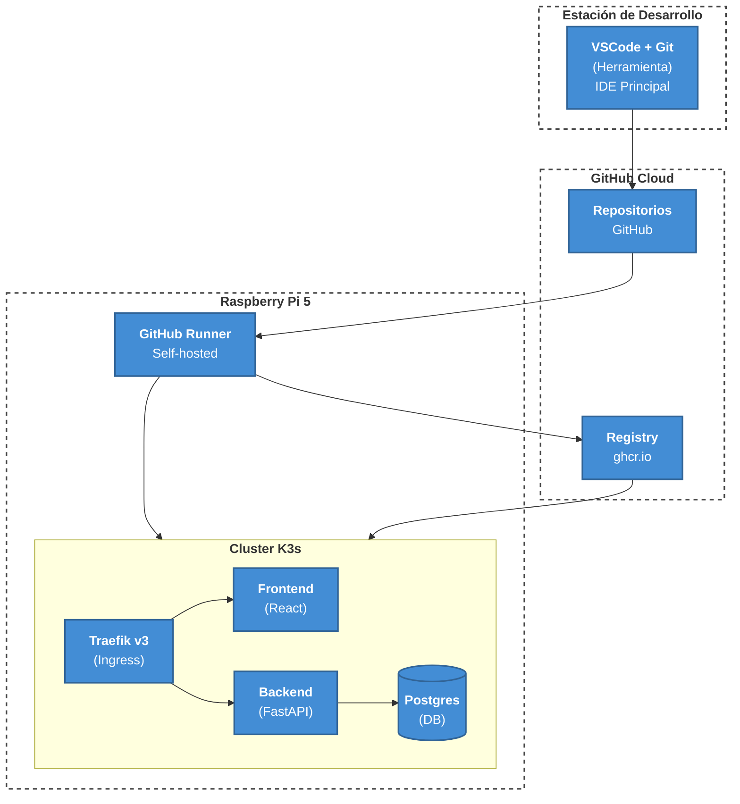
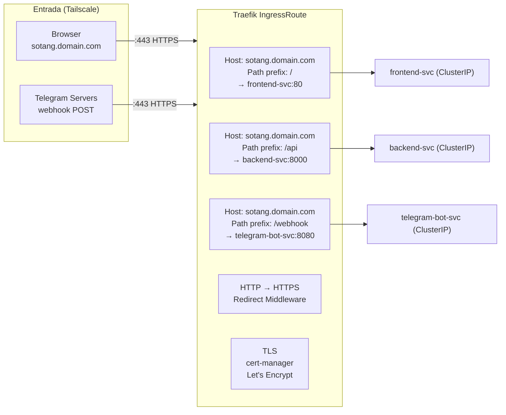
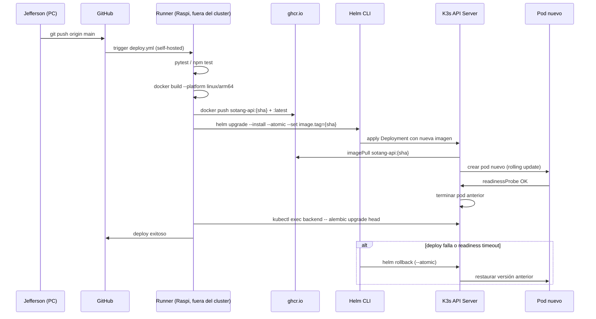

# Arquitectura — Despliegue (Deployment)

## C4 Deployment — Capas de infraestructura

## Diagrama de despliegue estructural

## Traefik — Routing rules

## Ciclo de vida de un deploy

## Decisiones clave

| Decisión                               | Motivo                                                                                                                 |
| -------------------------------------- | ---------------------------------------------------------------------------------------------------------------------- |
| **Runner fuera del cluster**           | El runner necesita Docker daemon — en K3s no hay Docker, solo containerd. Corre como systemd service en el host.       |
| **StatefulSets para Postgres y Redis** | Identidad de pod estable (postgres-0) + PVC propio. Los Deployments reinician con nombre aleatorio.                    |
| **hostPath para PVCs**                 | Single-node cluster — no hay necesidad de NFS ni distributed storage. Más simple, máximo throughput.                   |
| **Helm --atomic**                      | Si el deploy falla (readiness timeout, imagen corrupta), Helm hace rollback automático. Zero-downtime garantizado.     |
| **Tailscale como única entrada**       | No hay puertos públicos expuestos. Todo el tráfico pasa por el túnel WireGuard. Sin IP pública, sin firewall complejo. |
| **Namespace único `sotang`**           | Un solo usuario, un solo entorno. No hay necesidad de separar por ambiente en K3s.                                     |
