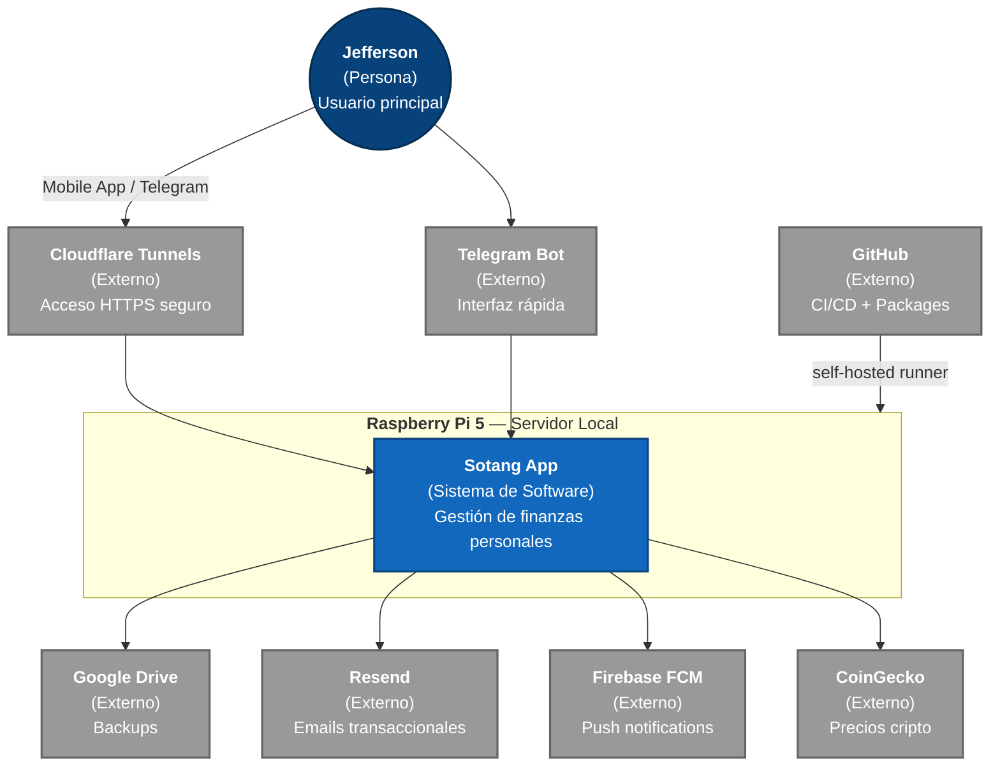
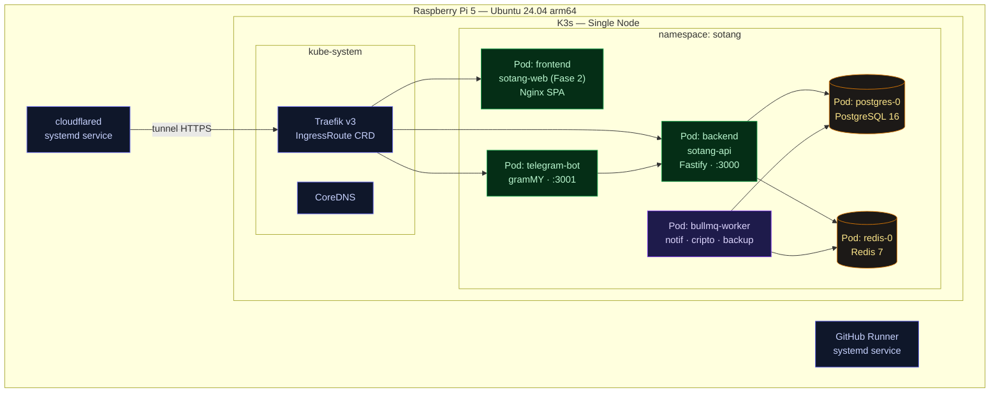
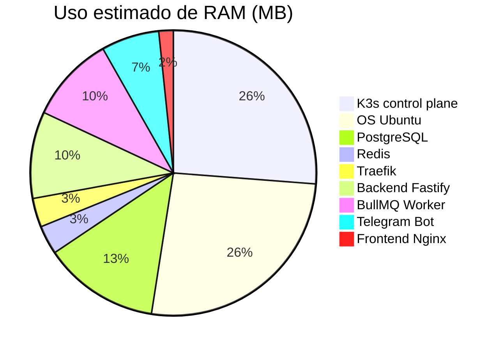

# Arquitectura — Visión General

Sotang corre en una Raspberry Pi 5 como servidor personal. El acceso externo es vía <strong>Cloudflare Tunnels</strong> — sin puertos abiertos, sin IP pública. Todos los datos permanecen en la Raspi.

## Diagrama de contexto del sistema (C4)

## Stack tecnológico

| Capa | Tecnología |
|------|-----------|
| **Mobile** | React Native + Expo · NativeWind · Redux Toolkit + RTK Query · Expo Router |
| **Backend** | Fastify 4 · TypeBox · Drizzle ORM · BullMQ 5 · Node.js 20 LTS |
| **Datos** | PostgreSQL 16 · Redis 7 · Filesystem NVMe |
| **Auth** | JWT access (15 min) + refresh (30 días) · bcrypt · SecureStore (mobile) |
| **Infra** | K3s · Traefik v3 · Helm · GitHub Actions self-hosted runner |
| **Acceso** | Cloudflare Tunnels (sin puertos expuestos) |
| **Notif** | Resend · Firebase FCM · gramMY (Telegram) |
| **Exports** | pdfmake · exceljs · CoinGecko API · Google Drive API |

## Arquitectura macro — K3s namespaces

## Decisiones arquitectónicas

| Decisión | Elección | Razón |
|----------|----------|-------|
| Patrón backend | Monolito Modular | Velocidad de desarrollo, límites claros entre módulos, un solo proceso Node.js |
| Repos | Polyrepo (6 repos) | CI/CD independiente, versionado autónomo, sin problemas Metro/symlinks |
| Background jobs | BullMQ + Redis | Colas persistentes, reintentos automáticos, UI Bull Board |
| Acceso externo | Cloudflare Tunnels | Sin puertos expuestos, HTTPS automático, funciona sin IP pública |
| Ingress | Traefik v3 (K3s built-in) | Routing por host/path, TLS, IngressRoute CRD |
| ORM | Drizzle ORM | Type-safe, sin runtime overhead, queries SQL explícitas |
| Orquestación | K3s | Self-healing, rolling updates, ~512 MB RAM — ideal Raspi |

## RAM estimada en Raspi (8 GB)

**Total estimado: ~1.95 GB / 8 GB — más de 6 GB de margen libre.**

## Principios de diseño

1. **Privacy by default** — datos en Raspi, sin nube para datos propios
2. **Self-healing** — K3s reinicia pods caídos automáticamente
3. **Zero-downtime deploy** — rolling updates vía Helm `--atomic`
4. **Modular pero cohesivo** — 12 módulos de negocio con interfaces explícitas
5. **Observable** — logs estructurados Pino, health checks en todos los pods
6. **Backup-first** — dos capas (local NVMe + Google Drive) antes de cualquier feature
