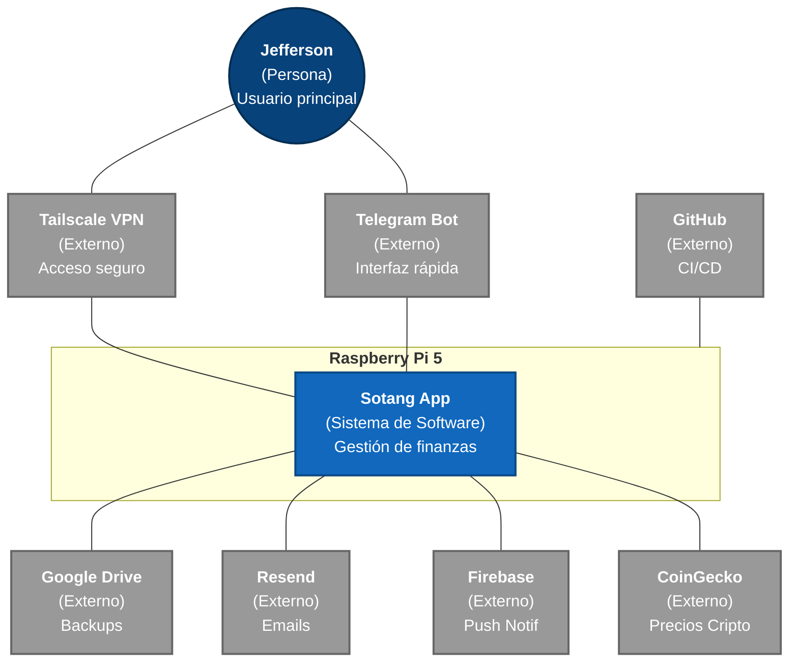
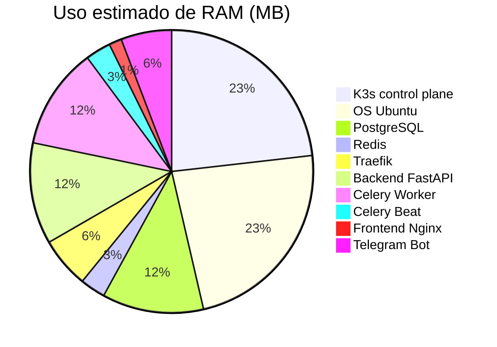

# Arquitectura — Visión General

Sotang corre en una Raspberry Pi 5 como servidor personal. El acceso es exclusivamente vía Tailscale VPN. Todos los datos son locales.

## Diagrama de Nivel Superior (IcePanel)

<iframe src='https://s.icepanel.io/HJNfFYeBu6z5ry/zY0u' height='800' width='100%' title='Sotang Landscape' style='border-radius: 16px; border: none; margin-bottom: 2rem;'></iframe>

## Diagrama de contexto del sistema (C4 - Mermaid)

## Decisiones arquitectónicas

| Decisión        | Elección                            | Razón                                                        |
| --------------- | ----------------------------------- | ------------------------------------------------------------ |
| Patrón backend  | Monolito Modular                    | Velocidad de desarrollo, límites claros por módulo           |
| Orquestación    | K3s                                 | Aprender K8s real, self-healing, rolling updates, ~512MB RAM |
| Background jobs | Celery + Redis                      | Reintentos automáticos, scheduling preciso                   |
| Deploy          | GitHub Actions + self-hosted runner | Push → deploy automático sin exponer puertos                 |
| Acceso externo  | Tailscale VPN                       | Sin puertos abiertos, seguro, desde cualquier dispositivo    |
| Ingress         | Traefik (built-in K3s)              | HTTPS automático, routing por path/host                      |
| DB              | PostgreSQL puro                     | Privacidad total, datos en Raspi                             |

## Stack tecnológico

| Capa     | Tecnología                                                                       |
| -------- | -------------------------------------------------------------------------------- |
| Frontend | React 18 + Vite + Tailwind + Zustand + TanStack Query + Recharts                 |
| Backend  | FastAPI + Pydantic v2 + SQLAlchemy 2 + Alembic + Celery 5                        |
| Datos    | PostgreSQL 16 + Redis 7 + Filesystem local                                       |
| Auth     | python-jose (JWT) + bcrypt                                                       |
| Infra    | K3s + Traefik v3 + Docker + GitHub Container Registry                            |
| Externas | Resend + firebase-admin + python-telegram-bot + httpx + google-api-python-client |
| Exports  | WeasyPrint (PDF) + openpyxl (Excel)                                              |

## RAM estimada en Raspi (8GB)

**Total estimado: ~2.2 GB / 8 GB — 5.8 GB de margen libre.**

## Principios

1. **Privacy by default** — datos en Raspi, sin cloud para datos propios
2. **Self-healing** — K3s reinicia pods caídos automáticamente
3. **Zero-downtime deploy** — rolling updates vía K3s Deployments
4. **Modular pero cohesivo** — módulos internos en FastAPI con interfaces claras
5. **Observable** — logs estructurados, health checks en todos los pods
6. **Backup-first** — dos capas de backup antes de cualquier feature
