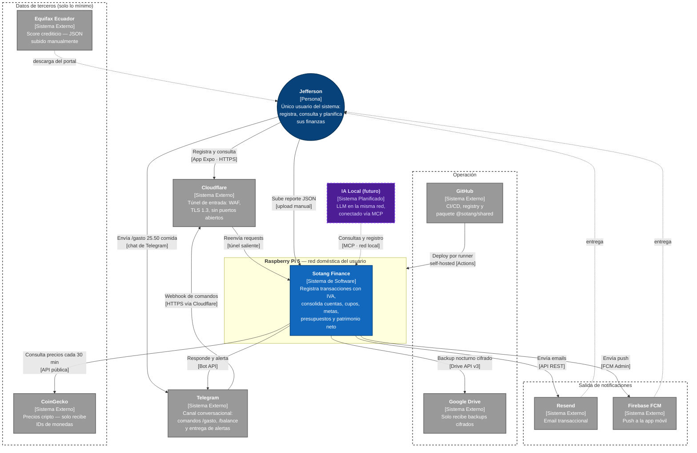
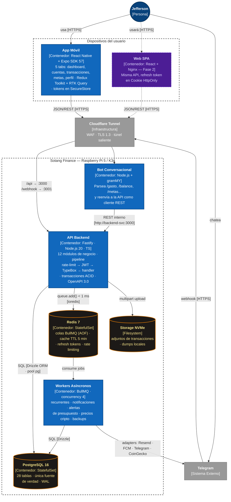
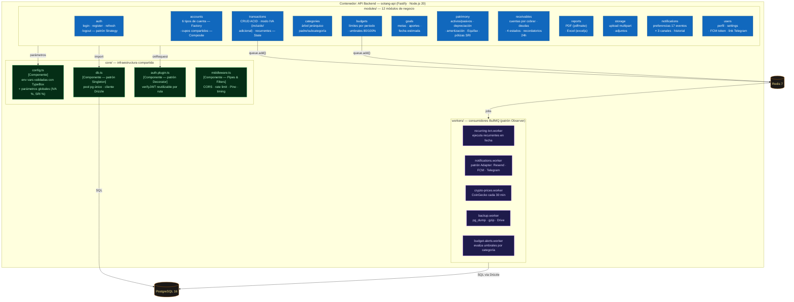
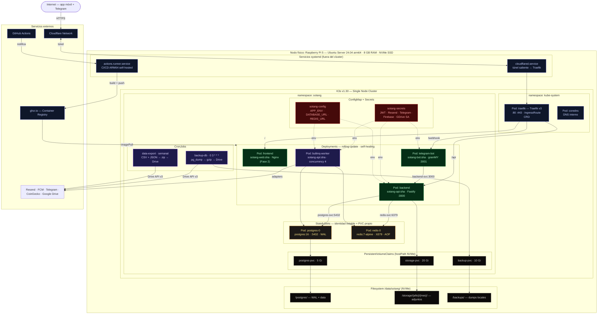
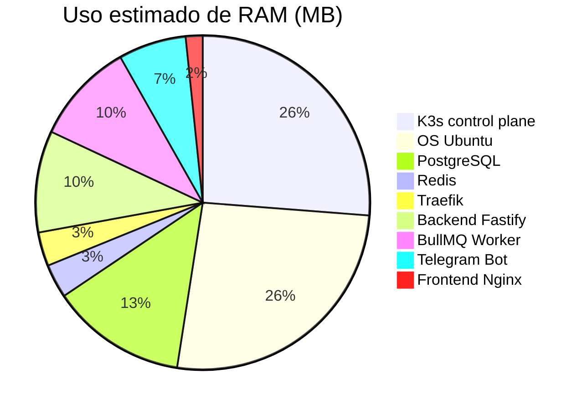

# Arquitectura — Visión General

Sotang corre en una Raspberry Pi 5 como servidor personal. El acceso externo es vía <strong>Cloudflare Tunnels</strong> — sin puertos abiertos, sin IP pública. Todos los datos permanecen en la Raspi.

## Diagrama de contexto del sistema (C4 — Nivel 1)

**Lectura del contexto:** Sotang es el único sistema con acceso a los datos financieros — cada externo recibe exclusivamente el mínimo para su función (CoinGecko: IDs de monedas; Drive: backups cifrados; Resend/FCM: el contenido del mensaje a entregar). El reporte Equifax nunca se consulta en línea: el usuario lo descarga del portal oficial y lo sube manualmente. La IA local vía MCP (punteada) es el único cliente futuro planificado — y por diseño operará dentro de la red doméstica.

## Stack tecnológico

| Capa | Tecnología |
|------|-----------|
| **Mobile** | React Native + Expo · NativeWind · Redux Toolkit + RTK Query · Expo Router |
| **Backend** | Fastify 4 · TypeBox · Drizzle ORM · BullMQ 5 · Node.js 20 LTS |
| **Datos** | PostgreSQL 16 · Redis 7 · Filesystem NVMe |
| **Auth** | JWT access (15 min) + refresh (30 días) · bcrypt · SecureStore (mobile) |
| **Infra** | K3s · Traefik v3 · Helm · GitHub Actions self-hosted runner |
| **Acceso** | Cloudflare Tunnels (sin puertos expuestos) |
| **Notif** | Resend · Firebase FCM · gramMY (Telegram) |
| **Exports** | pdfmake · exceljs · CoinGecko API · Google Drive API |

## Diagrama de aplicación / contenedores (C4 — Nivel 2)

Descompone el sistema en sus unidades desplegables. Cada contenedor declara su tecnología, su responsabilidad y el protocolo de cada relación:

**Decisiones visibles en este nivel:** el bot no toca la base de datos — es *un cliente más* de la API (Client-Server estricto); la API nunca envía notificaciones directamente — encola y responde (Event-Driven); y PostgreSQL/Redis solo son alcanzables pod-a-pod dentro del cluster.

## Diagrama de componentes (C4 — Nivel 3)

Dentro del contenedor **API Backend**: el núcleo compartido, los 12 módulos de negocio (cada uno con `router.ts · service.ts · schema.ts · repository.ts`) y los 5 workers. Los módulos dependen del core pero **jamás se importan entre sí** — la comunicación cruzada pasa por PostgreSQL (estado) o BullMQ (eventos):

**Trazabilidad con los patrones:** cada componente del core y varios módulos anotan el patrón GoF que los estructura — Singleton (db), Decorator (auth.plugin), Factory y Composite (accounts), State (transactions), Strategy (auth), Observer (workers) y Adapter (notifications.worker). El detalle con código está en [GoF Design Patterns](/entrega2/patrones-diseno).

## Diagrama de despliegue (C4 — Nivel 4 / infraestructura física)

El mapa físico completo: servicios systemd, el cluster K3s con sus namespaces, Deployments vs StatefulSets vs CronJobs, volúmenes persistentes, configuración y servicios externos:

**Lectura del despliegue:** lo que necesita identidad y disco propio (PostgreSQL, Redis) vive en StatefulSets; lo sin estado (API, bot, workers) en Deployments con rolling update; lo periódico (backup, export) en CronJobs de Kubernetes — sin cron externo. Los secrets nunca están en las imágenes: se inyectan como variables de entorno desde el Secret de K3s. Y el runner de CI/CD corre en la propia Raspi: el build ARM64 ocurre en el mismo hardware donde se despliega.

## Decisiones arquitectónicas

| Decisión | Elección | Razón |
|----------|----------|-------|
| Patrón backend | Monolito Modular | Velocidad de desarrollo, límites claros entre módulos, un solo proceso Node.js |
| Repos | Polyrepo (6 repos) | CI/CD independiente, versionado autónomo, sin problemas Metro/symlinks |
| Background jobs | BullMQ + Redis | Colas persistentes, reintentos automáticos, UI Bull Board |
| Acceso externo | Cloudflare Tunnels | Sin puertos expuestos, HTTPS automático, funciona sin IP pública |
| Ingress | Traefik v3 (K3s built-in) | Routing por host/path, TLS, IngressRoute CRD |
| ORM | Drizzle ORM | Type-safe, sin runtime overhead, queries SQL explícitas |
| Orquestación | K3s | Self-healing, rolling updates, ~512 MB RAM — ideal Raspi |

## RAM estimada en Raspi (8 GB)

**Total estimado: ~1.95 GB / 8 GB — más de 6 GB de margen libre.**

## Principios de diseño

1. **Privacy by default** — datos en Raspi, sin nube para datos propios
2. **Self-healing** — K3s reinicia pods caídos automáticamente
3. **Zero-downtime deploy** — rolling updates vía Helm `--atomic`
4. **Modular pero cohesivo** — 12 módulos de negocio con interfaces explícitas
5. **Observable** — logs estructurados Pino, health checks en todos los pods
6. **Backup-first** — dos capas (local NVMe + Google Drive) antes de cualquier feature
