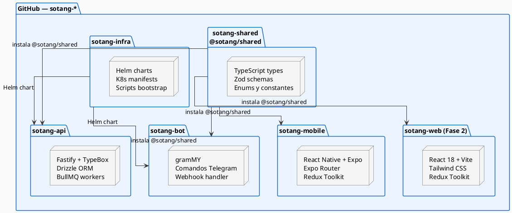
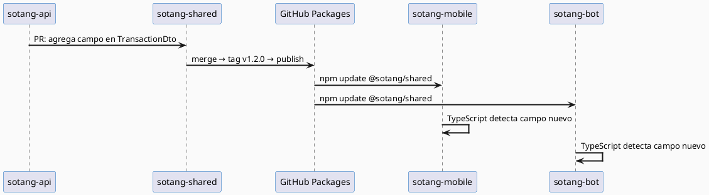

# Estrategia de Repositorios — Polyrepo

Sotang adopta una estrategia **Polyrepo**: cada aplicación o paquete compartido vive en su propio repositorio de GitHub, con su propio pipeline de CI/CD, versionado independiente y ciclo de despliegue autónomo.

---

## ¿Por qué Polyrepo?

| Factor | Monorepo (descartado) | Polyrepo (elegido) |
|--------|----------------------|--------------------|
| **Despliegues** | Un push puede disparar builds de partes no modificadas | Cada repo se despliega de forma completamente independiente |
| **CI/CD** | Pipeline único con filtros de path | Pipeline propio por servicio — más simple y aislado |
| **Escalabilidad futura** | Extraer un servicio requiere cirugía mayor | Cada repo ya es autónomo desde el día uno |
| **Metro (React Native/Expo)** | Requiere configuración especial de symlinks | Proyecto Expo estándar, sin configuración extra |
| **Control de versiones** | Una versión global del monorepo | Versiones semánticas independientes por repo |

---

## Repositorios del proyecto



| Repo | Contenido | Se despliega en |
|------|-----------|-----------------|
| **`sotang-shared`** | Tipos TypeScript, Zod schemas, enums — publicado en GitHub Packages | npm.pkg.github.com |
| **`sotang-api`** | Backend Fastify + Drizzle + workers BullMQ | K3s pod `backend` + `bullmq-worker` |
| **`sotang-bot`** | Telegram Bot gramMY | K3s pod `telegram-bot` |
| **`sotang-mobile`** | React Native + Expo | Google Play / App Store / OTA via EAS |
| **`sotang-infra`** | Helm charts + manifests K8s | Referenciado por pipelines |
| **`sotang-web`** | Dashboard React (Fase 2) | K3s pod `frontend` |

---

## Tipos compartidos — `@sotang/shared`

La pérdida de tipos compartidos automáticos es el principal trade-off del Polyrepo. Se resuelve con dos capas:

### Capa 1: paquete `@sotang/shared` en GitHub Packages

```
sotang-shared/
├── src/
│   ├── types/
│   │   ├── account.types.ts       # AccountType, IAccount, CreateAccountDto
│   │   ├── transaction.types.ts   # TransactionType, CreateTransactionDto
│   │   ├── auth.types.ts          # LoginDto, AuthResponse, JwtPayload
│   │   └── index.ts
│   ├── schemas/
│   │   └── transaction.schema.ts  # Zod schemas para validación
│   └── constants/
│       └── index.ts               # IVA_RATE, CURRENCIES, ACCOUNT_TYPES
└── package.json
```

**Instalación en repos consumidores:**
```json
{
  "dependencies": {
    "@sotang/shared": "^1.0.0"
  }
}
```

### Capa 2: OpenAPI spec auto-generada

Fastify genera automáticamente una especificación OpenAPI 3.0 a partir de los schemas TypeBox. Esta spec es el contrato formal entre la API y sus clientes.

```typescript
await fastify.register(require('@fastify/swagger'), {
  openapi: { info: { title: 'Sotang API', version: '1.0.0' } }
});
// Disponible en GET /documentation/json
```

### Flujo cuando cambia un tipo



---

## CI/CD por repositorio

Cada repo tiene su propio workflow. La Raspi corre un self-hosted runner que ejecuta los jobs localmente.

### `sotang-api` — `deploy.yml`

```yaml
name: Deploy API
on:
  push:
    branches: [main]

jobs:
  test-and-deploy:
    runs-on: self-hosted
    steps:
      - uses: actions/checkout@v4
      - uses: actions/setup-node@v4
        with:
          node-version: 20
          registry-url: https://npm.pkg.github.com
      - run: npm ci
        env:
          NODE_AUTH_TOKEN: ${{ secrets.GITHUB_TOKEN }}
      - run: npm test
      - name: Build & push Docker image
        run: |
          docker build -t ghcr.io/${{ github.repository_owner }}/sotang-api:${{ github.sha }} .
          docker push ghcr.io/${{ github.repository_owner }}/sotang-api:${{ github.sha }}
      - name: Helm upgrade
        run: |
          helm upgrade --install sotang-api ./helm/sotang-api \
            --set image.tag=${{ github.sha }} --atomic --timeout 120s
      - run: kubectl exec deployment/backend -n sotang -- npm run db:migrate
```

### `sotang-bot` — mismo patrón

Idéntico a `sotang-api` sustituyendo el nombre del servicio.

### `sotang-mobile` — `eas-build.yml`

```yaml
name: EAS Build
on:
  push:
    branches: [main]

jobs:
  build:
    runs-on: ubuntu-latest
    steps:
      - uses: actions/checkout@v4
      - uses: actions/setup-node@v4
        with:
          node-version: 20
          registry-url: https://npm.pkg.github.com
      - run: npm ci
        env:
          NODE_AUTH_TOKEN: ${{ secrets.GITHUB_TOKEN }}
      - uses: expo/expo-github-action@v8
        with:
          eas-version: latest
          token: ${{ secrets.EXPO_TOKEN }}
      - run: eas build --platform android --non-interactive --profile production
```

### `sotang-shared` — `publish.yml`

```yaml
name: Publish Package
on:
  push:
    tags: ['v*']

jobs:
  publish:
    runs-on: ubuntu-latest
    steps:
      - uses: actions/checkout@v4
      - uses: actions/setup-node@v4
        with:
          node-version: 20
          registry-url: https://npm.pkg.github.com
      - run: npm ci && npm run build
      - run: npm publish
        env:
          NODE_AUTH_TOKEN: ${{ secrets.GITHUB_TOKEN }}
```
