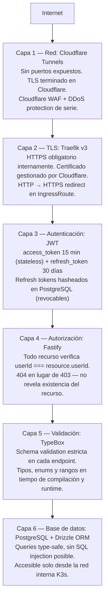
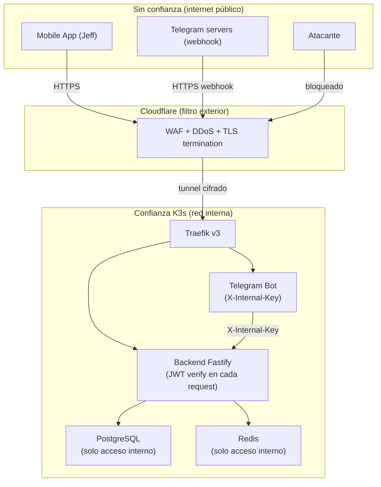

# Modelo de Seguridad

<p class="section-intro">Sotang implementa <strong>defensa en profundidad</strong> con 6 capas independientes. Comprometer una capa no compromete las demás. El modelo está diseñado para un servidor personal expuesto a internet vía Cloudflare Tunnels.</p>

## Defensa en profundidad — 6 capas



## Gestión de secretos

**Regla:** ningún secreto va en el repositorio, nunca.

| Secreto | Almacenamiento |
|---------|---------------|
| `DATABASE_URL` | K3s Secret |
| `JWT_SECRET` | K3s Secret — `openssl rand -hex 64` |
| `RESEND_API_KEY` | K3s Secret |
| `TELEGRAM_TOKEN` | K3s Secret |
| `FIREBASE_KEY` | K3s Secret (JSON completo) |
| `GDRIVE_SA_JSON` | K3s Secret (JSON completo) |
| `CLOUDFLARE_TUNNEL_TOKEN` | K3s Secret / systemd env |

```
Desarrollador → kubectl create secret → K3s Secrets
                                              ↓ env vars inyectadas
                                        Pods K3s → process.env
```

`.env` y `.env.*` siempre en `.gitignore`.

## Auth mobile vs web

| Aspecto | Mobile (React Native) | Web SPA (Fase 2) |
|---------|-----------------------|------------------|
| Token storage | `expo-secure-store` (Keychain iOS / Keystore Android) | Cookie HttpOnly + SameSite=Strict |
| Token envío | `Authorization: Bearer` header | Cookie automática |
| CSRF | N/A (no cookies) | SameSite=Strict previene CSRF |
| Refresh | JSON body `{ refreshToken }` | Cookie HttpOnly (invisible a JS) |

## Amenazas y mitigaciones

| Amenaza | Mitigación |
|---------|-----------|
| **XSS** | React Native no tiene DOM · Web: React escapa por default + CSP headers |
| **CSRF** | Mobile: sin cookies · Web: SameSite=Strict + Cookie HttpOnly |
| **SQL Injection** | Drizzle ORM — queries parameterizadas, imposible inyectar |
| **IDOR** | Filtro `userId` en **todos** los queries · 404 en lugar de 403 |
| **Brute force login** | Rate limit: 10 req/min en `POST /auth/login` (Fastify rate limit plugin) |
| **Token theft** | access_token 15 min · refresh revocable en DB · HTTPS obligatorio |
| **User enumeration** | Mismo mensaje para "no existe" y "contraseña incorrecta" |
| **Puertos expuestos** | Cloudflare Tunnels — sin puertos abiertos en el router |
| **Secrets en código** | K3s Secrets + `.gitignore` estricto |
| **Passwords legibles** | bcrypt con salt (cost=12) |
| **DDoS** | Cloudflare WAF + rate limiting de Cloudflare |

## Headers de seguridad (Nginx — Fase 2 web)

```
Strict-Transport-Security: max-age=31536000; includeSubDomains
X-Content-Type-Options: nosniff
X-Frame-Options: DENY
Content-Security-Policy: default-src 'self'
Referrer-Policy: strict-origin-when-cross-origin
```

## Límites de confianza



## Autenticación de canales

| Canal | Mecanismo |
|-------|-----------|
| Mobile App | `Authorization: Bearer {accessToken}` |
| Telegram Bot → API | `X-Internal-Key: {SECRET}` (solo red interna K3s) |
| Endpoints públicos | Sin auth: `POST /auth/login`, `POST /auth/register`, `GET /health` |
