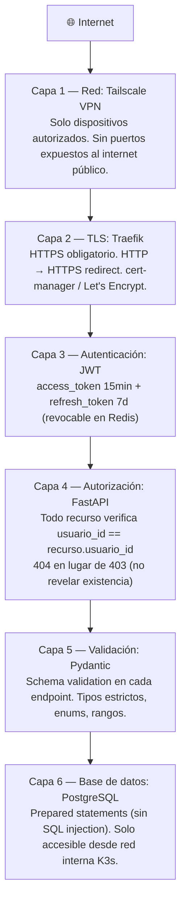
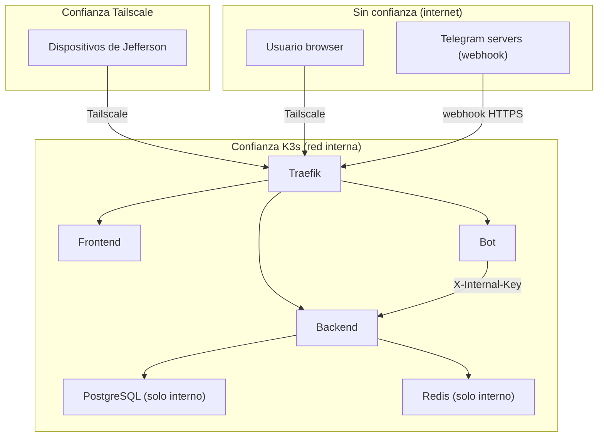

# Modelo de Seguridad

## Defensa en profundidad — 6 capas



## Gestión de secretos

**Regla:** ningún secreto va en el repositorio, nunca.

| Secreto          | Destino                             |
| ---------------- | ----------------------------------- |
| `DB_PASSWORD`    | K3s Secret                          |
| `JWT_SECRET`     | K3s Secret — `openssl rand -hex 64` |
| `RESEND_API_KEY` | K3s Secret                          |
| `TELEGRAM_TOKEN` | K3s Secret                          |
| `FIREBASE_KEY`   | K3s Secret (JSON completo)          |
| `GDRIVE_SA_JSON` | K3s Secret (JSON completo)          |

```
Desarrollador → kubectl create secret → Raspi (K3s Secrets)
                                              ↓ env vars inyectadas
                                        Pods K3s → os.environ
```

`.env` y `.env.*` siempre en `.gitignore`.

## Amenazas y mitigaciones

| Amenaza            | Mitigación                                                         |
| ------------------ | ------------------------------------------------------------------ |
| XSS                | React escapa por default + CSP headers en Nginx                    |
| CSRF               | JWT en header (no cookie) · SameSite=Strict                        |
| SQL Injection      | SQLAlchemy ORM · Prepared statements siempre                       |
| IDOR               | Filtro `usuario_id` en **todos** los queries · 404 en lugar de 403 |
| Brute force login  | Rate limit: 10 req/min en `/auth/login`                            |
| Token theft        | access_token 15min · refresh revocable · HTTPS obligatorio         |
| User enumeration   | Mismo mensaje para "no existe" y "contraseña incorrecta"           |
| Puertos expuestos  | Tailscale VPN · sin puertos públicos                               |
| Secretos en código | K3s Secrets · `.gitignore` estricto                                |
| Passwords legibles | bcrypt con salt (cost=12)                                          |

## Headers de seguridad (Nginx)

```
Strict-Transport-Security: max-age=31536000; includeSubDomains
X-Content-Type-Options: nosniff
X-Frame-Options: DENY
Content-Security-Policy: default-src 'self'
Referrer-Policy: strict-origin-when-cross-origin
```

## Límites de confianza



## Checklist de seguridad

- [x] JWT_SECRET generado con `openssl rand -hex 64`
- [x] Passwords con bcrypt cost=12
- [x] Secretos en K3s Secrets, no en repo
- [x] `.env` y `.env.*` en `.gitignore`
- [x] HTTPS obligatorio (Traefik + TLS)
- [x] Rate limiting en `/auth/login`
- [x] Sin puertos expuestos (solo Tailscale)
- [x] Todo endpoint verifica `usuario_id == recurso.usuario_id`
- [x] Logs sin passwords ni tokens
- [x] PostgreSQL sin acceso externo al cluster
- [x] Redis sin acceso externo al cluster
