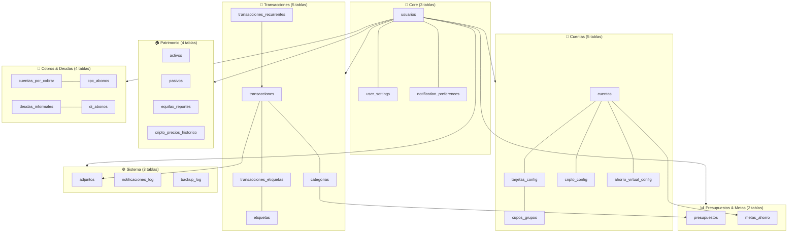

# Base de Datos — ERD Completo

**26 tablas · PostgreSQL 16 · UUIDs como PKs · TIMESTAMPTZ en todos los timestamps**

## Mapa de dominios

```mermaid
graph TB
    subgraph CORE["👤 Core (3 tablas)"]
        U["usuarios"] --- US["user_settings"]
        U --- NP["notification_preferences"]
    end
    subgraph ACCOUNTS["🏦 Cuentas (5 tablas)"]
        C["cuentas"] --- TC["tarjetas_config"]
        C --- CC["cripto_config"]
        C --- AV["ahorro_virtual_config"]
        TC --- CG["cupos_grupos"]
    end
    subgraph TXN["💸 Transacciones (5 tablas)"]
        T["transacciones"] --- CAT["categorias"]
        TR["transacciones_recurrentes"] --> T
        T --- TE["transacciones_etiquetas"] --- ET["etiquetas"]
    end
    subgraph BUDGET["📊 Presupuestos & Metas (2 tablas)"]
        P["presupuestos"]
        MA["metas_ahorro"]
    end
    subgraph PAT["🏠 Patrimonio (4 tablas)"]
        A["activos"]
        PA["pasivos"]
        EQ["equifax_reportes"]
        CPH["cripto_precios_historico"]
    end
    subgraph REC["🤝 Cobros & Deudas (4 tablas)"]
        CPC["cuentas_por_cobrar"] --- CPCA["cpc_abonos"]
        DI["deudas_informales"] --- DIA["di_abonos"]
    end
    subgraph SYS["⚙️ Sistema (3 tablas)"]
        ADJ["adjuntos"]
        NL["notificaciones_log"]
        BL["backup_log"]
    end

    U --> ACCOUNTS & TXN & BUDGET & PAT & REC & SYS
    CAT --> P
    C --> MA
    T --> ADJ
```

## ERD completo

```mermaid
erDiagram
    usuarios {
        uuid id PK
        string nombre
        string email
        string password_hash
        string timezone
        string moneda
        string modo_ui
        string telegram_chat_id
        boolean activo
        boolean email_verificado
        timestamptz creado_en
        timestamptz ultimo_login
    }
    user_settings {
        uuid id PK
        uuid usuario_id FK
        decimal iva_porcentaje
        int alerta_presupuesto_pct
        int dias_notif_recurrente
        int dias_notif_corte
        boolean auto_registrar_recurrentes
        int crypto_update_interval_min
    }
    cuentas {
        uuid id PK
        uuid usuario_id FK
        string nombre
        string tipo
        decimal saldo_inicial
        decimal saldo_actual
        boolean activa
        boolean incluir_en_total
    }
    tarjetas_config {
        uuid id PK
        uuid cuenta_id FK
        decimal cupo_total
        uuid cupo_grupo_id FK
        int fecha_corte
        int fecha_pago
        decimal tasa_interes_anual
    }
    cupos_grupos {
        uuid id PK
        uuid usuario_id FK
        string nombre
        decimal cupo_total
    }
    cripto_config {
        uuid id PK
        uuid cuenta_id FK
        string simbolo
        decimal cantidad
        decimal precio_actual_usd
        boolean precio_desactualizado
    }
    ahorro_virtual_config {
        uuid id PK
        uuid cuenta_id FK
        uuid cuenta_padre_id FK
    }
    categorias {
        uuid id PK
        uuid usuario_id FK
        string nombre
        string tipo
        boolean es_sistema
        uuid parent_id FK
    }
    transacciones {
        uuid id PK
        uuid usuario_id FK
        string tipo
        decimal monto
        decimal monto_sin_iva
        decimal iva_monto
        boolean incluye_iva
        uuid categoria_id FK
        uuid cuenta_id FK
        uuid cuenta_destino_id FK
        date fecha
        string canal
        uuid recurrente_id FK
        string estado
        timestamptz creado_en
    }
    transacciones_recurrentes {
        uuid id PK
        uuid usuario_id FK
        string tipo
        decimal monto
        uuid categoria_id FK
        uuid cuenta_id FK
        string frecuencia
        date fecha_inicio
        date fecha_fin
        boolean activa
        date proxima_ejecucion
    }
    etiquetas {
        uuid id PK
        uuid usuario_id FK
        string nombre
    }
    transacciones_etiquetas {
        uuid transaccion_id FK
        uuid etiqueta_id FK
    }
    presupuestos {
        uuid id PK
        uuid usuario_id FK
        uuid categoria_id FK
        decimal monto
        string periodo
        int alerta_porcentaje
        boolean activo
    }
    metas_ahorro {
        uuid id PK
        uuid usuario_id FK
        string nombre
        decimal monto_objetivo
        decimal monto_actual
        date fecha_objetivo
        string tipo
        uuid cuenta_id FK
        boolean completada
    }
    activos {
        uuid id PK
        uuid usuario_id FK
        string nombre
        string tipo
        decimal valor_compra
        date fecha_compra
        decimal valor_actual
        decimal tasa_depreciacion_anual
        boolean activo
    }
    pasivos {
        uuid id PK
        uuid usuario_id FK
        string nombre
        string tipo
        decimal monto_original
        decimal saldo_pendiente
        decimal tasa_interes_anual
        decimal cuota_mensual
        boolean activo
    }
    equifax_reportes {
        uuid id PK
        uuid usuario_id FK
        int score_principal
        int score_inclusion
        decimal capacidad_pago
        decimal cupo_sugerido
        boolean inhabilitado
        jsonb raw_json
        timestamptz creado_en
    }
    cripto_precios_historico {
        uuid id PK
        string simbolo
        decimal precio_usd
        timestamptz registrado_en
    }
    cuentas_por_cobrar {
        uuid id PK
        uuid usuario_id FK
        string deudor_nombre
        decimal monto_original
        decimal monto_pagado
        date fecha_prometida
        string estado
    }
    cuentas_por_cobrar_abonos {
        uuid id PK
        uuid cuenta_cobrar_id FK
        decimal monto
        date fecha
    }
    deudas_informales {
        uuid id PK
        uuid usuario_id FK
        string acreedor_nombre
        decimal monto_original
        decimal monto_pagado
        date fecha_prometida
        string estado
    }
    deudas_informales_abonos {
        uuid id PK
        uuid deuda_id FK
        decimal monto
        date fecha
    }
    adjuntos {
        uuid id PK
        uuid usuario_id FK
        uuid transaccion_id FK
        string nombre_original
        string ruta
        string tipo_mime
        int tamano_bytes
    }
    notificaciones_log {
        uuid id PK
        uuid usuario_id FK
        string evento
        string canal
        string estado
        jsonb metadata
        timestamptz creado_en
    }
    backup_log {
        uuid id PK
        string tipo
        string estado
        string gdrive_file_id
        bigint tamano_bytes
        timestamptz completado_en
    }

    usuarios ||--|| user_settings : "tiene"
    usuarios ||--o{ cuentas : "posee"
    usuarios ||--o{ categorias : "define"
    usuarios ||--o{ transacciones : "registra"
    usuarios ||--o{ transacciones_recurrentes : "programa"
    usuarios ||--o{ presupuestos : "define"
    usuarios ||--o{ metas_ahorro : "tiene"
    usuarios ||--o{ activos : "posee"
    usuarios ||--o{ pasivos : "tiene"
    usuarios ||--o{ equifax_reportes : "sube"
    usuarios ||--o{ cuentas_por_cobrar : "registra"
    usuarios ||--o{ deudas_informales : "registra"
    cuentas ||--o| tarjetas_config : "extiende"
    cuentas ||--o| cripto_config : "extiende"
    cuentas ||--o| ahorro_virtual_config : "extiende"
    cupos_grupos ||--o{ tarjetas_config : "agrupa"
    categorias ||--o{ transacciones : "clasifica"
    categorias ||--o{ presupuestos : "presupuesta"
    categorias ||--o{ categorias : "subcategoría"
    transacciones_recurrentes ||--o{ transacciones : "genera"
    transacciones ||--o{ transacciones_etiquetas : "tiene"
    etiquetas ||--o{ transacciones_etiquetas : "usada en"
    transacciones ||--o{ adjuntos : "tiene"
    metas_ahorro }o--o| cuentas : "vinculada a"
    cuentas_por_cobrar ||--o{ cuentas_por_cobrar_abonos : "recibe"
    deudas_informales ||--o{ deudas_informales_abonos : "recibe"
```
