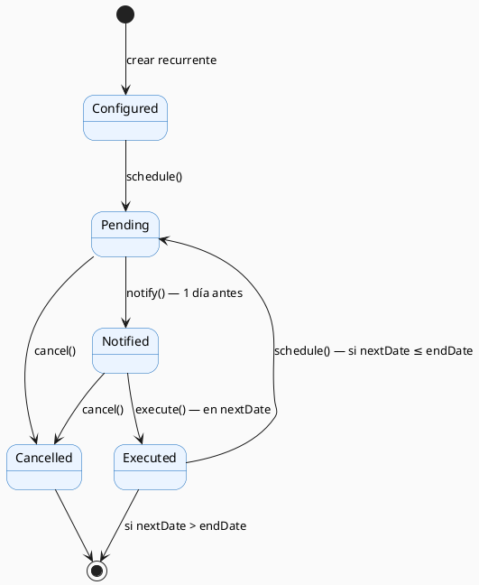

# Análisis Formal del Diseño y Arquitectura

El análisis formal aplica **métodos estructurados** para verificar propiedades del diseño de Sotang antes de escribir código: consistencia (no hay contradicciones), completitud (no faltan casos) y ausencia de condiciones de bloqueo. Se complementa con un análisis de riesgos arquitectónicos cuantificado.

---

## 1. Checklist ATAM (Architecture Tradeoff Analysis Method)

El **ATAM** es un método de revisión arquitectónica que evalúa qué tan bien la arquitectura satisface los atributos de calidad. Para cada atributo se plantea un escenario de prueba y se evalúa si el diseño lo satisface.

| Atributo | Escenario de prueba | Resultado | Evidencia en diseño |
|----------|--------------------|-----------|--------------------|
| **Disponibilidad** | ¿El sistema se recupera solo si un pod falla? | ✅ Cumple | K3s reinicia pods automáticamente (self-healing). Tiempo de recuperación < 30s. |
| **Seguridad** | ¿Un usuario puede acceder a datos de otro? | ✅ Cumple | Todo recurso verifica `userId === recurso.userId`. Se retorna 404 (no 403) para no revelar existencia. |
| **Rendimiento** | ¿La API responde en < 200ms para requests comunes? | ✅ Cumple | Cache Redis TTL 5min para transacciones. Tareas lentas delegadas a BullMQ. |
| **Mantenibilidad** | ¿Se puede agregar un tipo de cuenta sin modificar código existente? | ✅ Cumple | `AccountFactory` + `IAccount`: solo se agrega una clase nueva. |
| **Escalabilidad** | ¿El sistema puede manejar más usuarios sin rediseño? | ⚠️ Parcial | Intencional para un usuario. K3s permite réplicas del backend, pero la DB es nodo único. Aceptable para el caso de uso actual. |
| **Testabilidad** | ¿Los módulos se pueden probar sin arrancar Fastify ni la DB? | ✅ Cumple | `service.ts` separado de `routes.ts`. Inyección de dependencias por constructor. Workers desacoplados. |
| **Interoperabilidad** | ¿Se puede integrar un nuevo canal (ej. WhatsApp)? | ✅ Cumple | Patrón Adapter: agregar `WhatsAppAdapter implements INotificationProvider` sin tocar el worker. |
| **Privacidad** | ¿Los datos quedan fuera de servicios cloud de terceros? | ✅ Cumple | PostgreSQL en Raspberry Pi. Cloudflare solo enruta tráfico cifrado, no almacena datos. |

---

## 2. Contratos de interfaz

Los contratos definen formalmente **qué garantiza** cada operación crítica. Se expresan en lenguaje semi-formal basado en Design by Contract (DbC).

### Contrato 1: `POST /api/v1/auth/login`

```
PRECONDICIONES:
  - email ∈ string ∧ cumple formato RFC 5322
  - password ∈ string ∧ |password| >= 8
  - client ∈ { "mobile", "web" }
  - El usuario identificado por email existe en la tabla users
  - No superó 5 intentos fallidos en los últimos 15 min (rate limit)

POSTCONDICIONES:
  - Si password correcto:
      → accessToken (JWT, TTL: 15 min) generado
      → refreshToken (JWT, TTL: 30 días) almacenado en Redis
      → Si client = "mobile": ambos tokens en body JSON
      → Si client = "web": refreshToken en Cookie HttpOnly
      → HTTP 200
  - Si password incorrecto:
      → HTTP 401 { error: "Invalid credentials" }
      → Contador de intentos fallidos incrementado en Redis

INVARIANTE:
  - Nunca se revela si el email existe o no (mismo mensaje siempre)
  - El hash bcrypt nunca aparece en ninguna respuesta
```

### Contrato 2: `POST /api/v1/transactions`

```
PRECONDICIONES:
  - request.user.id válido (garantizado por AuthDecorator)
  - amount ∈ ℝ⁺
  - type ∈ { "expense", "income", "transfer" }
  - accountId existe en accounts WHERE userId = request.user.id

POSTCONDICIONES:
  - INSERT en transactions con userId = request.user.id
  - UPDATE balance en accounts
  - Si CreditCard: UPDATE used_amount en AccountGroup
  - Job encolado en notificationsQueue
  - Job encolado en budgetQueue
  - HTTP 201 con la transacción creada

INVARIANTE:
  - Si el INSERT falla, el UPDATE en accounts se revierte (ACID)
  - Un usuario nunca puede crear transacciones en cuentas de otro usuario
```

### Contrato 3: `RecurringTransaction.execute()`

```
PRECONDICIONES:
  - state = PendingState ∨ state = NotifiedState
  - nextDate ≤ fecha actual del sistema

POSTCONDICIONES:
  - Nueva Transaction creada derivada de RecurringTransaction
  - nextDate = calcularSiguienteOcurrencia(frequency, nextDate)
  - Si nextDate > endDate: state → ExecutedState (permanente)
  - Si nextDate ≤ endDate: state → PendingState (ciclo continúa)

INVARIANTE:
  - Si state ≠ PendingState y state ≠ NotifiedState: lanza InvalidStateException
  - Nunca se ejecuta la misma ocurrencia dos veces (idempotencia via BullMQ job ID único)
```

---

## 3. Verificación de consistencia y completitud

### 3.1 Modelo de estados — RecurringTransaction

Verificación de que el diagrama de estados no tenga transiciones contradictorias ni estados trampa.



**Tabla de completitud** — cada estado define respuesta para los 4 eventos:

| Estado \ Evento | schedule() | notify() | execute() | cancel() |
|---|---|---|---|---|
| Configured | → Pending | ❌ Excepción | ❌ Excepción | → Cancelled |
| Pending | ❌ Excepción | → Notified | ❌ Excepción | → Cancelled |
| Notified | ❌ Excepción | ❌ Excepción | → Executed | → Cancelled |
| Executed | → Pending | ❌ Excepción | ❌ Excepción | → Cancelled |
| Cancelled | ❌ Excepción | ❌ Excepción | ❌ Excepción | ❌ Excepción |

**Conclusión**: El modelo es **completo** (no hay eventos sin respuesta) y **consistente** (no hay transiciones contradictorias desde el mismo estado con el mismo evento).

### 3.2 Ausencia de deadlock en workers

Se verifica que los workers no tienen dependencias circulares:

```
NotificationWorker  → PostgreSQL (no depende de otros workers)
BudgetAlertWorker   → PostgreSQL (no depende de otros workers)
RecurringTxnWorker  → PostgreSQL → encola en "notifications" (unidireccional)
```

**Dependencia unidireccional**: `RecurringTxnWorker → NotificationWorker` pero nunca al revés. **No hay ciclo → no hay deadlock.**

---

## 4. Análisis de riesgos arquitectónicos

**R = Probabilidad × Impacto** — Escala: Bajo (1-2), Medio (3-4), Alto (6), Crítico (9)

| # | Riesgo | P (1-3) | I (1-3) | R | Nivel | Mitigación |
|---|--------|:---:|:---:|:---:|:---:|---|
| R1 | **Raspberry Pi falla físicamente** | 2 | 3 | **6** | 🔴 Alto | Backup diario en Google Drive. Recuperación documentada. |
| R2 | **Cloudflare Tunnel cae** | 2 | 3 | **6** | 🔴 Alto | `cloudflared` pod con `restartPolicy: Always`. Recuperación < 2 min. |
| R3 | **Redis pierde jobs BullMQ** (sin persistencia) | 2 | 2 | **4** | 🟡 Medio | Configurar `appendonly yes` (AOF). Jobs críticos con `removeOnComplete: false`. |
| R4 | **Cambio de proveedor de notificaciones** | 1 | 2 | **2** | 🟢 Bajo | Patrón Adapter: solo agregar una clase nueva. |
| R5 | **JWT robado** | 1 | 3 | **3** | 🟡 Medio | Access token TTL = 15 min. Refresh revocable via `DEL` en Redis. |
| R6 | **AccountFactory crece sin control** | 2 | 1 | **2** | 🟢 Bajo | Acción correctiva: tabla de constructores cuando NOC > 6. |
| R7 | **Transacción a medio ejecutar** | 1 | 3 | **3** | 🟡 Medio | Transacciones ACID en PostgreSQL. BullMQ reintenta con backoff exponencial. |
| R8 | **Escalabilidad futura** | 1 | 2 | **2** | 🟢 Bajo | Monolito Modular facilita extracción futura. K3s ya permite múltiples réplicas. |

**Riesgos prioritarios: R1 y R2** (R = 6). Ambos tienen mitigación activa. No hay riesgos en categoría Crítica (R = 9).

---

## 5. Reflexión crítica

### Fortalezas del diseño

1. **Defensa en profundidad**: 6 capas de seguridad (red → TLS → JWT → autorización → validación → DB).
2. **Fail-fast en validación**: TypeBox valida el schema en la capa HTTP antes de tocar la lógica de negocio.
3. **Idempotencia en workers**: BullMQ usa IDs únicos por job — no se crean duplicados en reintentos.
4. **Estado consistente por invariantes**: Los contratos garantizan que la DB nunca queda en estado parcialmente actualizado.

### Limitaciones reconocidas

1. **Single Point of Failure físico**: La Raspberry Pi es el único nodo. No hay failover automático ante fallo de hardware.
2. **Sin replicación de PostgreSQL**: Toda la carga va al mismo nodo — aceptable para un usuario.
3. **Dependencia de Cloudflare**: Si Cloudflare tiene interrupción global, el sistema queda inaccesible aunque la Raspi funcione perfectamente.

**Conclusión**: El diseño es robusto para su contexto (app personal, un usuario, hardware propio). Las limitaciones son consecuencias conscientes de las restricciones del proyecto, no errores de diseño.
