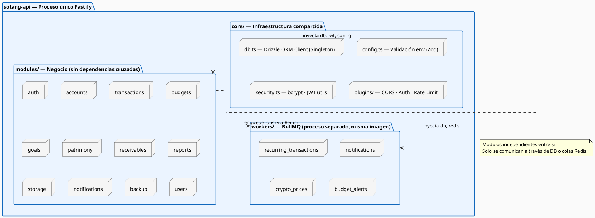
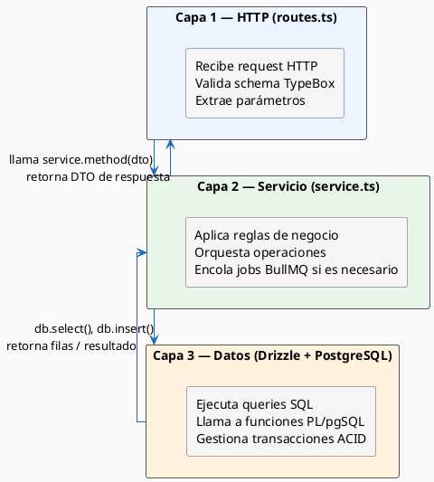
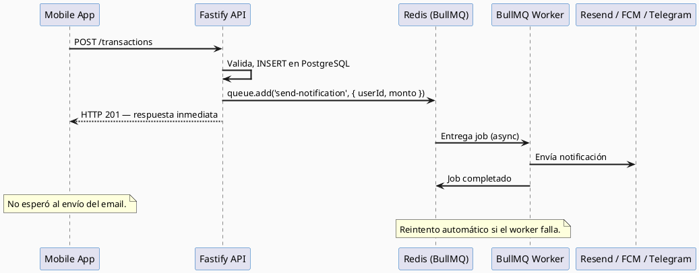
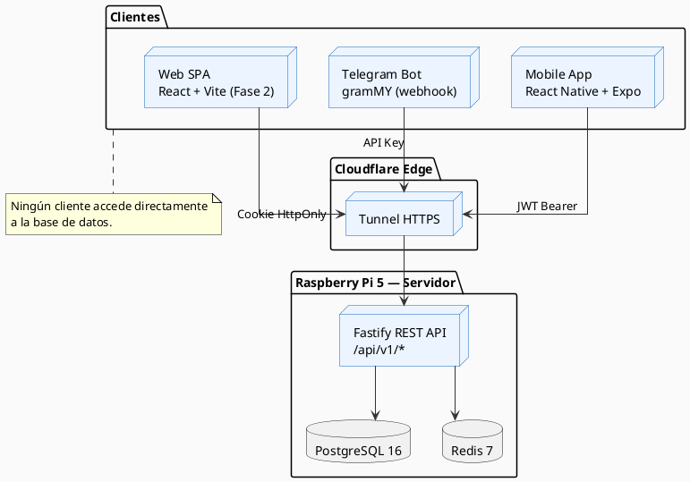
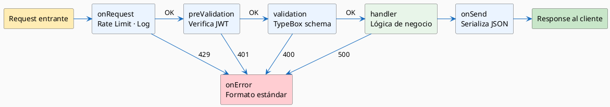
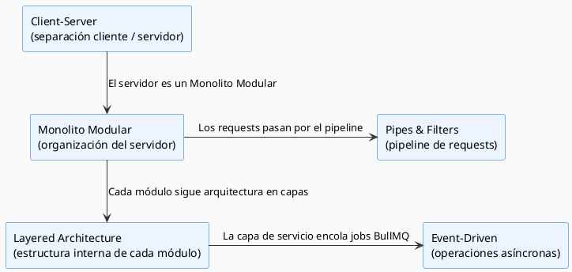

# Patrones Arquitectónicos — Sotang

Sotang aplica **cinco patrones arquitectónicos** que actúan en capas complementarias: dos organizan la estructura interna del backend, uno gobierna la comunicación asíncrona, uno define el estilo de comunicación cliente-servidor y uno estructura el pipeline de procesamiento de requests. Ninguno fue elegido por moda — cada uno responde a una restricción concreta del sistema.

---

## Resumen de patrones aplicados

| # | Patrón | Alcance | Justificación principal |
|---|--------|---------|------------------------|
| 1 | **Monolito Modular** | Backend (Fastify) | Velocidad de desarrollo, bajo consumo de RAM en Raspi |
| 2 | **Layered Architecture** | Backend (estructura interna) | Separación clara entre HTTP, negocio y datos |
| 3 | **Event-Driven / Queue-Based** | Workers (BullMQ + Redis) | Desacoplar tareas lentas del ciclo request-response |
| 4 | **Client-Server** | Sistema completo | Separación móvil/bot/web del backend único |
| 5 | **Pipes & Filters** | Pipeline de requests Fastify | Composición limpia de validación, auth y logging |

---

## 1. Monolito Modular

### Descripción

El backend de Sotang (`sotang-api`) es un único proceso Fastify que agrupa **12 módulos de negocio** con fronteras explícitas. Cada módulo es autocontenido — tiene sus propias rutas, lógica de negocio y schemas — pero **comparte** la conexión a la base de datos y los servicios de infraestructura del `core/`. Los módulos **no se llaman entre sí directamente**: la comunicación cruzada ocurre exclusivamente a través de la base de datos o de colas BullMQ.

### Justificación para Sotang

| Factor | Razón |
|--------|-------|
| **Recursos limitados** | La Raspberry Pi 5 tiene 8 GB de RAM. Microservicios implicarían múltiples runtimes Node.js. El monolito consume un solo runtime. |
| **Usuario único** | No hay necesidad de escalar módulos de forma independiente. |
| **Velocidad de desarrollo** | Sin overhead de comunicación inter-servicio ni versionado de contratos. |
| **Límites claros** | Los módulos tienen fronteras definidas, lo que facilita extraerlos como microservicios en el futuro. |

### Diagrama de estructura



---

## 2. Layered Architecture (Arquitectura en Capas)

### Descripción

Dentro del monolito, cada módulo sigue una **arquitectura en capas de 3 niveles**. Las capas superiores pueden llamar a las inferiores, pero nunca al revés.

```
HTTP Layer  →  Service Layer  →  Data Access Layer
(routes.ts)    (service.ts)      (Drizzle + PostgreSQL)
```

### Capas y responsabilidades

| Capa | Archivo | Responsabilidad |
|------|---------|-----------------|
| **HTTP Layer** | `routes.ts` | Definir endpoints, validar schema TypeBox, llamar al service |
| **Service Layer** | `service.ts` | Lógica de negocio, reglas de dominio, orquestación |
| **Data Access Layer** | `db.ts` + Drizzle | Queries SQL, transacciones, stored procedures PL/pgSQL |

### Diagrama de capas



---

## 3. Event-Driven / Queue-Based Architecture

### Descripción

Toda operación que no debe bloquear el ciclo request-response se delega a una cola BullMQ sobre Redis. El backend encola un job y responde inmediatamente. Un proceso worker separado consume la cola de forma asíncrona.

**Se aplica a**: notificaciones, transacciones recurrentes, precios cripto (CoinGecko), backup diario y alertas de presupuesto.

### Justificación para Sotang

| Factor | Razón |
|--------|-------|
| **Latencia** | El cliente no espera a que se envíe un email. La API responde en < 50ms. |
| **Resiliencia** | Si el worker falla, BullMQ reintenta automáticamente (max 3 intentos, backoff exponencial). |
| **Desacoplamiento** | El módulo de `transactions` no necesita saber cómo funciona el envío de notificaciones. |

### Diagrama de flujo



---

## 4. Client-Server

### Descripción

Sotang separa estrictamente los **clientes** (Mobile App, Telegram Bot, Web SPA en Fase 2) del **servidor** (Fastify API). La comunicación ocurre exclusivamente a través de una API REST con JSON. Los clientes no tienen acceso directo a la base de datos.

### Clientes y canales de acceso

| Cliente | Canal | Autenticación |
|---------|-------|---------------|
| Mobile App (Expo) | HTTPS via Cloudflare Tunnels | JWT Bearer (SecureStore) |
| Telegram Bot (gramMY) | HTTPS Webhook via Cloudflare | API Key interna |
| Web SPA (Fase 2) | HTTPS via Cloudflare Tunnels | JWT Cookie HttpOnly |



---

## 5. Pipes & Filters (Pipeline de Fastify)

### Descripción

Fastify implementa un sistema de **hooks y plugins** que forma un pipeline para cada request entrante. Si cualquier etapa falla, el request se rechaza y no continúa al handler.

### Etapas del pipeline

| Etapa (Hook Fastify) | Responsabilidad | Si falla |
|----------------------|-----------------|----------|
| `onRequest` | Rate limiting, logging de entrada | HTTP 429 |
| `preValidation` | Verificación JWT | HTTP 401 |
| `validation` | Schema TypeBox | HTTP 400 |
| `preHandler` | Lógica custom pre-handler | HTTP 4xx |
| **handler** | Lógica de negocio del módulo | — |
| `onSend` | Serialización de respuesta | — |
| `onError` | Manejo centralizado de errores | HTTP 5xx |



---

## Relación entre los cinco patrones


