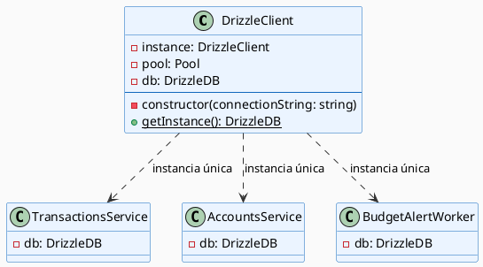
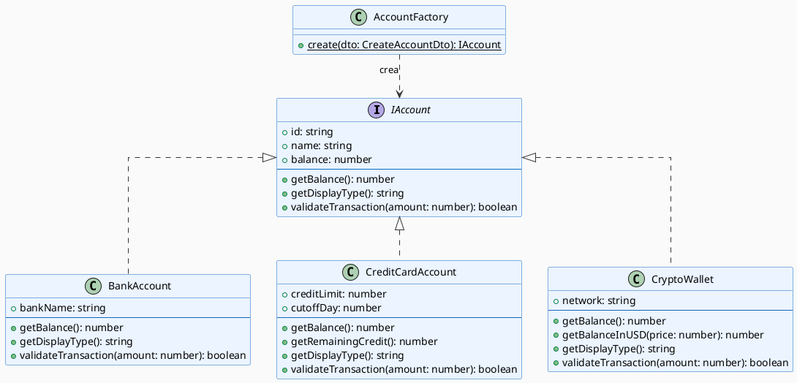
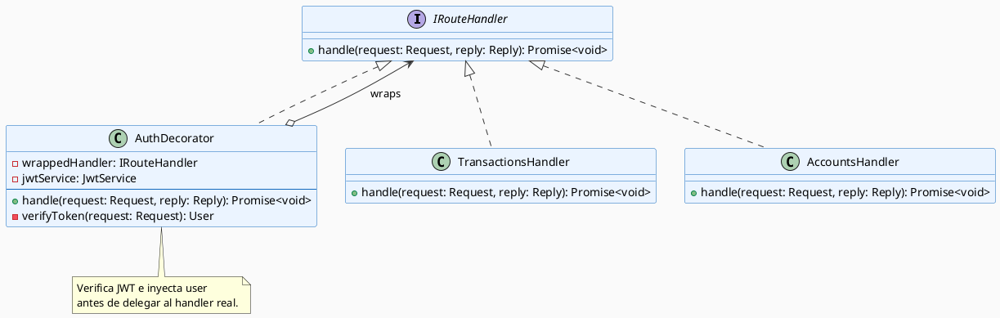
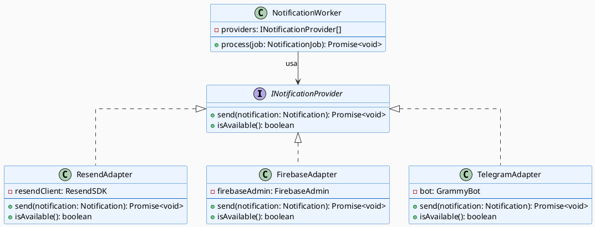
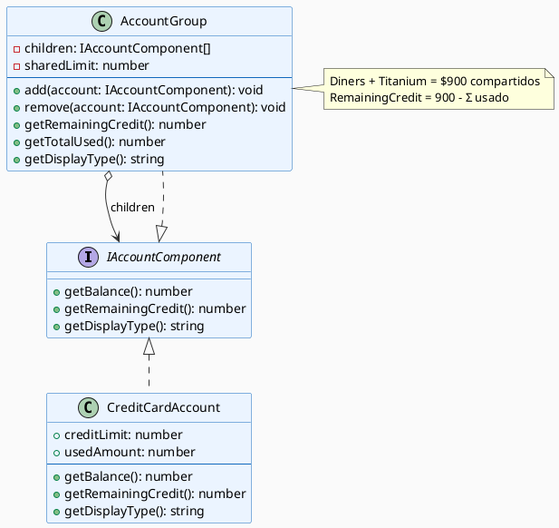
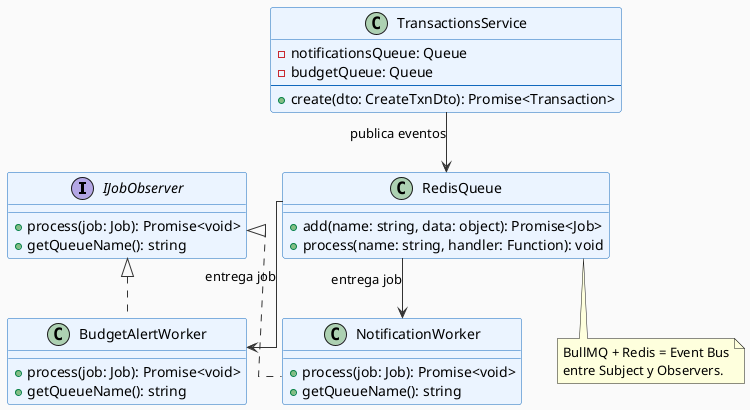
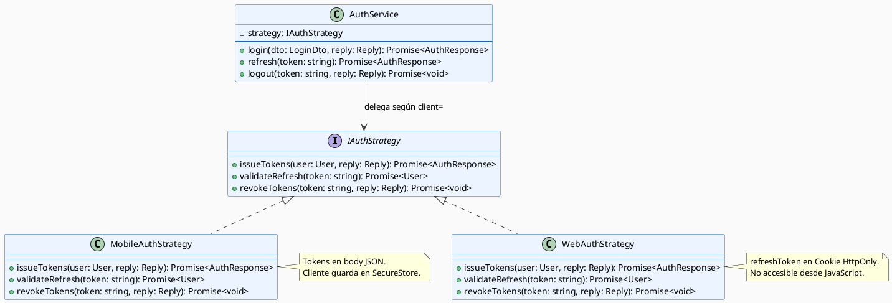
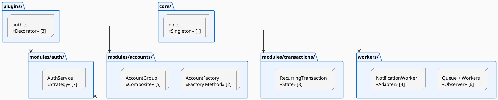

# Patrones de Diseño (GoF) — Sotang

Sotang aplica **8 patrones de diseño GoF** distribuidos en 4 grupos de módulos. Cada patrón responde a un problema concreto del sistema — no son decorativos. Se presenta el problema, la solución aplicada y el diagrama de clases UML.

---

## Índice de patrones

| # | Patrón | Categoría GoF | Módulo / Capa |
|---|--------|:---:|---|
| 1 | **Singleton** | Creacional | `core/db.ts` |
| 2 | **Factory Method** | Creacional | `modules/accounts/` |
| 3 | **Decorator** | Estructural | `plugins/auth.ts` |
| 4 | **Adapter** | Estructural | `workers/notifications.ts` |
| 5 | **Composite** | Estructural | `modules/accounts/` (cupos compartidos) |
| 6 | **Observer** | Comportamiento | `workers/` (BullMQ + Redis) |
| 7 | **Strategy** | Comportamiento | `modules/auth/` |
| 8 | **State** | Comportamiento | `modules/transactions/` |

---

## Patrón 1 — Singleton (`core/db.ts`)

**Problema**: Si cada módulo creara su propia instancia del pool de conexiones a PostgreSQL, se abrirían decenas de pools simultáneos, agotando la memoria de la Raspberry Pi.

**Solución**: `db.ts` crea el pool **una sola vez** al arrancar el proceso y lo exporta como objeto inmutable. Todos los módulos importan la misma referencia.

```typescript
// core/db.ts
const pool = new Pool({ connectionString: env.DATABASE_URL });
export const db = drizzle(pool, { schema });
// Los módulos hacen: import { db } from '@/core/db'
```



---

## Patrón 2 — Factory Method (`modules/accounts/`)

**Problema**: Sotang maneja 6 tipos de cuenta con comportamientos distintos (bancaria, tarjeta de crédito, ahorro virtual, efectivo, criptowallet, inversión). Crear cada tipo con condicionales en el servicio mezcla responsabilidades.

**Solución**: `AccountFactory` decide qué objeto Account instanciar según el `tipo`, devolviendo siempre una interfaz común `IAccount`.



---

## Patrón 3 — Decorator (`plugins/auth.ts`)

**Problema**: La verificación JWT no debe repetirse en cada handler de cada módulo — sería duplicación masiva y un riesgo de seguridad.

**Solución**: El plugin de autenticación de Fastify actúa como Decorator: envuelve el routing y añade verificación JWT a cualquier ruta que declare `{ onRequest: [fastify.authenticate] }`, sin modificar el handler original.



---

## Patrón 4 — Adapter (`workers/notifications.ts`)

**Problema**: Sotang usa tres proveedores de notificaciones (Resend, Firebase FCM, Telegram Bot API) con SDKs e interfaces incompatibles entre sí.

**Solución**: Se define una interfaz interna `INotificationProvider` y se crea un Adapter por cada proveedor. El worker solo conoce `INotificationProvider`.



---

## Patrón 5 — Composite (`modules/accounts/` — cupos compartidos)

**Problema**: Las tarjetas Diners Club y Titanium comparten un cupo único de $900. Un modelo plano de cuentas independientes no puede expresar esta relación.

**Solución**: `AccountGroup` contiene sub-cuentas y delega `getRemainingCredit()` al grupo, que suma el uso de todas sus hijas.



---

## Patrón 6 — Observer (`workers/` — BullMQ)

**Problema**: Cuando se registra una transacción, múltiples partes del sistema deben reaccionar (presupuesto, notificación, metas). Llamar directamente a cada servicio genera acoplamiento fuerte.

**Solución**: BullMQ + Redis actúan como bus de eventos. El servicio publica un job; los workers son suscriptores independientes que reaccionan sin que el servicio los conozca.



---

## Patrón 7 — Strategy (`modules/auth/`)

**Problema**: La autenticación necesita dos comportamientos distintos: móvil (tokens en body JSON, guardados en SecureStore) y web (refresh token en Cookie HttpOnly, nunca accesible desde JS).

**Solución**: Cada estrategia se encapsula en su clase. El servicio de auth delega a la estrategia correcta según el parámetro `client` del request.



---

## Patrón 8 — State (`modules/transactions/` — recurrentes)

**Problema**: Las transacciones recurrentes pasan por múltiples estados con reglas estrictas de transición. Sin un modelo de estados, el código acumula condicionales complejos dispersos.

**Solución**: Cada estado es una clase que define qué transiciones son válidas. `RecurringTransaction` delega el comportamiento a su estado actual.

```plantuml
@startuml patron-state
skinparam backgroundColor #FAFAFA
skinparam classBackgroundColor #EBF4FF
skinparam classBorderColor #1168bd
skinparam ArrowColor #333333
skinparam linetype ortho

interface IRecurringState {
    + schedule(txn: RecurringTransaction): void
    + notify(txn: RecurringTransaction): void
    + execute(txn: RecurringTransaction): void
    + cancel(txn: RecurringTransaction): void
    + getStatus(): string
}

class RecurringTransaction {
    - id: string
    - amount: number
    - nextDate: Date
    - state: IRecurringState
    --
    + schedule(): void
    + notify(): void
    + execute(): void
    + cancel(): void
    + setState(state: IRecurringState): void
}

class ConfiguredState { + getStatus(): string }
class PendingState    { + getStatus(): string }
class NotifiedState   { + getStatus(): string }
class ExecutedState   { + getStatus(): string }
class CancelledState  { + getStatus(): string }

IRecurringState <|.. ConfiguredState
IRecurringState <|.. PendingState
IRecurringState <|.. NotifiedState
IRecurringState <|.. ExecutedState
IRecurringState <|.. CancelledState

RecurringTransaction --> IRecurringState : estado actual

ConfiguredState ..> PendingState  : schedule()
PendingState    ..> NotifiedState : notify() — 1 día antes
NotifiedState   ..> ExecutedState : execute() — en fecha
NotifiedState   ..> CancelledState : cancel()
ExecutedState   ..> PendingState  : siguiente ocurrencia
@enduml
```

---

## Mapa de patrones sobre la arquitectura


