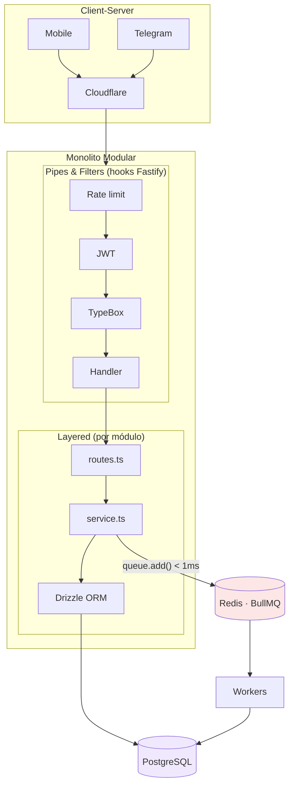
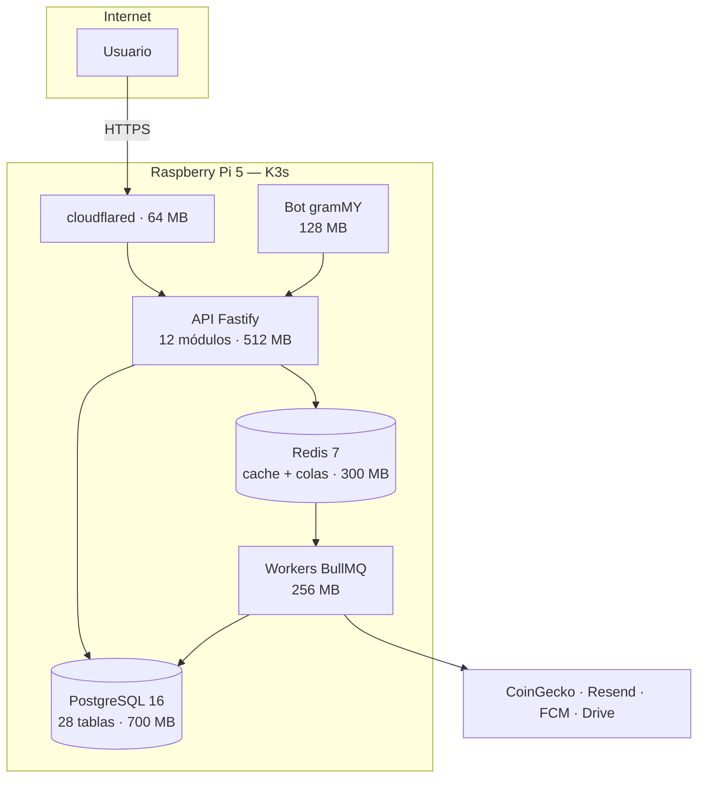

<PresHero
  badge="Acto 4"
  title="Arquitectura"
  subtitle="Un Monolito Modular sobre K3s en una Raspberry Pi 5 — explora cada capa"
/>

## El sistema completo, capa por capa

<ArchLayers />

## ¿Por qué un Monolito Modular y no microservicios?

<Reveal>

<StatGrid :stats="[
  { value: 150, suffix: ' MB', label: 'RAM del monolito Fastify' },
  { value: 900, suffix: ' MB', label: 'RAM de 6 microservicios equivalentes' },
  { value: 48, suffix: '%', label: 'Uso total de los 8 GB de la Raspi' },
  { value: 12, label: 'Módulos con fronteras explícitas' },
]"/>

Los módulos **no se llaman entre sí directamente**: toda comunicación cruzada pasa por la base de datos o por colas BullMQ. Eso mantiene las ventajas de fronteras claras (como microservicios) sin pagar el overhead de red y memoria.

</Reveal>

## Los 5 patrones arquitectónicos en acción

<Reveal>

**Event-Driven** es la pieza que une todo: el request nunca espera por un email, una alerta o un PDF — se encola y el worker lo resuelve en segundo plano.

</Reveal>

## El viaje de un request, en vivo

<Reveal>

Así fluye el registro de una transacción: la ruta azul es síncrona (menos de 100 ms), la verde es la respuesta al cliente, y la ámbar es todo lo que ocurre en segundo plano sin bloquear al usuario:

<FlowAnim />

</Reveal>

## Vista C4 — Contenedores

<Reveal>

Ningún cliente toca la base de datos: PostgreSQL solo es accesible pod-a-pod dentro del cluster.

</Reveal>

<Reveal>

::: info Documentación completa
Los diagramas C4 de los 4 niveles, el detalle de componentes y el deployment K3s están en [Architecture → System Overview](/arquitectura/overview).
:::

</Reveal>

---

  <a href="./casos-de-uso">← Casos de Uso</a>
  <a href="./seguridad">Siguiente: Seguridad →</a>

