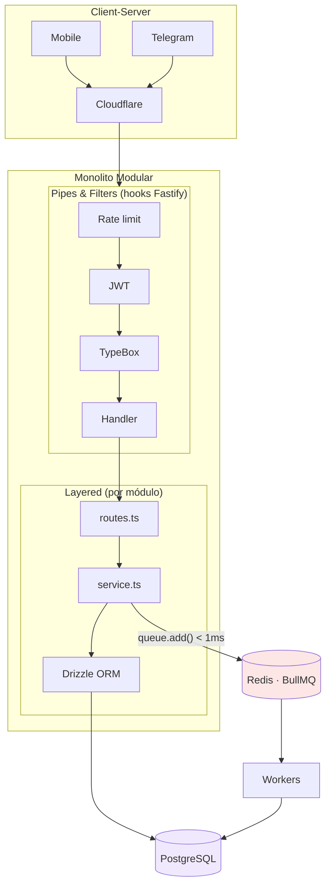
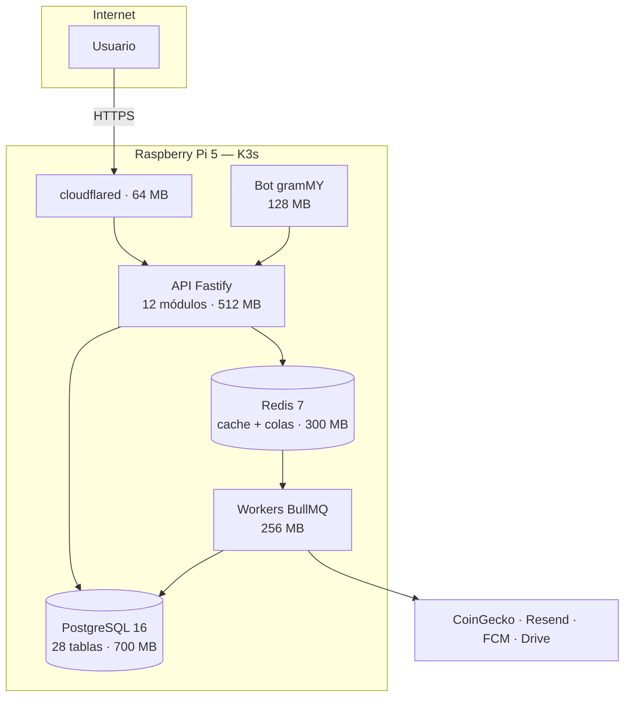
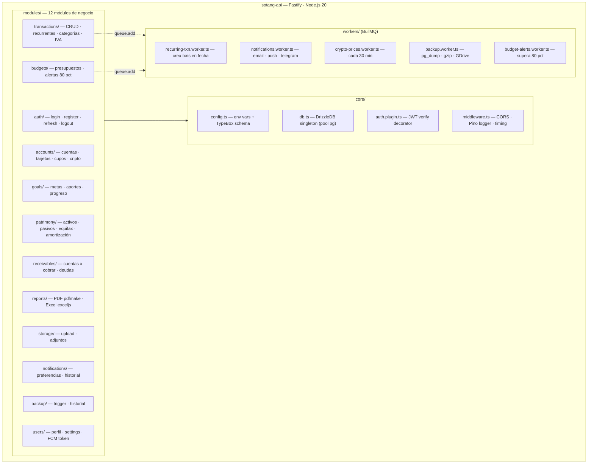
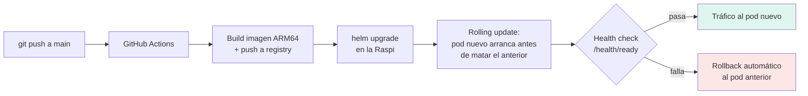
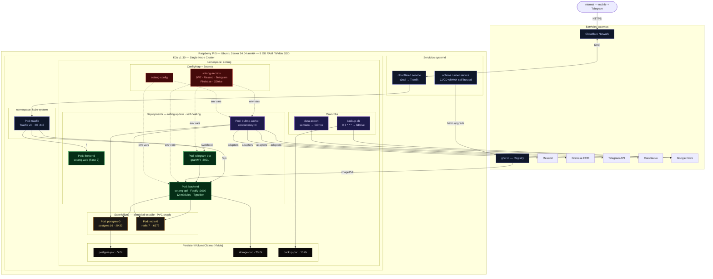

<PresHero
  badge="Acto 4"
  title="Arquitectura"
  subtitle="Un Monolito Modular sobre K3s en una Raspberry Pi 5 — explora cada capa"
/>

## El sistema completo, capa por capa

<ArchLayers />

## ¿Por qué un Monolito Modular y no microservicios?

<Reveal>

<StatGrid :stats="[
  { value: 150, suffix: ' MB', label: 'RAM del monolito Fastify' },
  { value: 900, suffix: ' MB', label: 'RAM de 6 microservicios equivalentes' },
  { value: 48, suffix: '%', label: 'Uso total de los 8 GB de la Raspi' },
  { value: 12, label: 'Módulos con fronteras explícitas' },
]"/>

Los módulos **no se llaman entre sí directamente**: toda comunicación cruzada pasa por la base de datos o por colas BullMQ. Eso mantiene las ventajas de fronteras claras (como microservicios) sin pagar el overhead de red y memoria.

</Reveal>

## Los 5 estilos y la restricción que motiva a cada uno

<Reveal>

Ningún estilo se eligió por moda — cada uno responde a una restricción concreta y medible del proyecto:

| # | Estilo arquitectónico | Alcance | Restricción que lo motiva |
|---|----------------------|---------|--------------------------|
| 1 | Monolito Modular | Backend completo (Fastify) | Un runtime Node.js consume ~150 MB vs ~1.2 GB de 6 microservicios en la Raspi |
| 2 | Layered Architecture | Interno de cada módulo | Testabilidad: el `service.ts` debe probarse sin Fastify ni PostgreSQL |
| 3 | Event-Driven / Queue-Based | Workers BullMQ | Latencia: el cliente no espera emails ni consultas a CoinGecko |
| 4 | Client-Server | Sistema completo | Multicanal: el mismo backend sirve a mobile, Telegram y web sin duplicar lógica |
| 5 | Pipes and Filters | Pipeline de requests | Composición: auth + validación se configuran una vez, aplican a todas las rutas |

</Reveal>

## Los 5 patrones arquitectónicos en acción

<Reveal>

**Event-Driven** es la pieza que une todo: el request nunca espera por un email, una alerta o un PDF — se encola y el worker lo resuelve en segundo plano.

</Reveal>

## El viaje de un request, en vivo

<Reveal>

Así fluye el registro de una transacción: la ruta azul es síncrona (menos de 100 ms), la verde es la respuesta al cliente, y la ámbar es todo lo que ocurre en segundo plano sin bloquear al usuario:

<FlowAnim />

</Reveal>

## Las 5 decisiones de arquitectura (ADR)

Cada decisión estructural está documentada como Architecture Decision Record: contexto, decisión, consecuencias a favor y en contra. Expande cada una:

<AdrAccordion :adrs="[
  {
    id: 'ADR-01', title: 'Auto-alojamiento en Raspberry Pi 5',
    context: 'El sistema maneja datos financieros extremadamente sensibles y se necesita un servidor de producción con costo operativo mínimo.',
    decision: 'Desplegar todo el sistema en una Raspberry Pi 5 propiedad del usuario, en su red doméstica.',
    pros: ['Costo mensual $0 en hosting', 'Privacidad total: ningún dato sale de la red doméstica', 'Latencia mínima en acceso local'],
    cons: ['Single point of failure físico', 'Sin failover automático ante falla de hardware', 'CPU limitada (ARM Cortex-A76, 4 núcleos)'],
    mitigation: 'Backup diario automático a Google Drive; K3s reinicia pods automáticamente para recuperación de software.'
  },
  {
    id: 'ADR-02', title: 'K3s como orquestador de contenedores',
    context: 'Se necesita self-healing, rolling updates y separación de responsabilidades entre servicios, sobre hardware limitado.',
    decision: 'Usar K3s (Kubernetes ligero) en lugar de Docker Compose o Kubernetes completo.',
    pros: ['~512 MB de RAM vs ~4 GB de Kubernetes completo', 'Ecosistema Kubernetes real: Helm, kubectl, pods, namespaces, PVCs', 'Rolling updates sin downtime'],
    cons: ['Curva de aprendizaje mayor que Docker Compose', 'Requiere manifiestos YAML y Helm charts'],
  },
  {
    id: 'ADR-03', title: 'Monolito Modular en Fastify vs microservicios',
    context: 'Doce módulos de negocio diferenciados sobre una Raspi de 8 GB de RAM y 4 núcleos ARM.',
    decision: 'Un Monolito Modular en Fastify (Node.js 20, TypeScript) con fronteras explícitas por módulo.',
    pros: ['Un solo proceso: ~150 MB de RAM', 'Cero overhead de comunicación inter-servicio', 'Velocidad de desarrollo sin versionado de contratos entre servicios'],
    cons: ['El proceso completo se reinicia si falla (mitigado por K3s)', 'Todos los módulos comparten el runtime (mitigado con workers BullMQ separados)'],
  },
  {
    id: 'ADR-04', title: 'Polyrepo: 6 repositorios independientes',
    context: 'Seis componentes con ciclos de despliegue distintos: API, bot, app móvil, infraestructura, web y documentación.',
    decision: 'Seis repositorios independientes en lugar de un monorepo.',
    pros: ['Despliegues independientes sin riesgo cruzado', 'CI/CD simple: un Dockerfile y un Helm chart por repo', 'Expo sin configuración especial de Metro para workspaces'],
    cons: ['Tipos TypeScript no compartidos directamente — se publica @sotang/shared en GitHub Packages'],
  },
  {
    id: 'ADR-05', title: 'Cloudflare Tunnels para acceso externo',
    context: 'La Raspi está en una red doméstica sin IP pública estática; los webhooks de Telegram y la app móvil deben alcanzar la API desde internet.',
    decision: 'Exponer el servicio mediante Cloudflare Tunnels (conexión saliente desde la Raspi).',
    pros: ['HTTPS automático + WAF incluido sin configuración', 'Cero puertos abiertos en el router', 'IP residencial nunca expuesta', 'Plan gratuito: $0'],
    cons: ['Dependencia de la disponibilidad de Cloudflare: si cae globalmente, el sistema queda inaccesible desde fuera aunque la Raspi funcione'],
  },
]" />

## Vista C4 — Contenedores

<Reveal>

Ningún cliente toca la base de datos: PostgreSQL solo es accesible pod-a-pod dentro del cluster.

</Reveal>

## C4 Nivel 3 — Diagrama de Componentes del Backend

<Reveal>

Los 12 módulos de negocio comparten los servicios del núcleo (`core/`) pero jamás se importan entre sí — cada módulo contiene `router.ts` · `service.ts` · `schema.ts` (TypeBox) · `repository.ts` (Drizzle):

La regla se cumple por estructura: la comunicación entre módulos pasa por PostgreSQL (estado) o por BullMQ (eventos) — nunca por imports directos. El detalle vive en [Components & Modules](/arquitectura/componentes).

</Reveal>

## El contrato de la API

<Reveal>

REST versionada en `/api/v1`, con la especificación **OpenAPI 3.0 generada automáticamente** desde los schemas TypeBox — la documentación no puede desactualizarse porque sale del mismo código que valida:

| Convención | Regla |
|-----------|-------|
| Versionado | Prefijo `/api/v1` — cambios incompatibles irían a `/v2` sin romper clientes |
| Colecciones | `{ data: [...], total, page, limit }` — paginación uniforme en todos los módulos |
| Errores | Formato único: `{ error, message }` con códigos semánticos (`token_expired`, `not_found`) |
| Validación | HTTP 400/422 con el detalle del campo — TypeBox valida antes de tocar la lógica |
| Recursos ajenos | HTTP 404 (no 403) — no se revela la existencia de datos de otros usuarios |
| Documentación | Swagger UI en `/documentation`, colección Postman versionada en el repo |

13 grupos de endpoints (auth, accounts, transactions, budgets, goals, patrimony, receivables, reports, notifications, storage, backup, users, health) — el detalle completo está en [API Design](/arquitectura/api-design).

</Reveal>

## Despliegue y operación

<Reveal>

El ciclo de vida de un deploy — de `git push` a producción sin downtime:

Y en operación, K3s aporta lo que un servidor casero normalmente no tiene:

| Capacidad | Cómo |
|-----------|------|
| Self-healing | `restartPolicy: Always` — un pod caído se reinicia en < 30 s |
| Datos que sobreviven a los pods | PersistentVolumeClaims para PostgreSQL y adjuntos |
| Config separada del código | Secrets y ConfigMaps de Kubernetes |
| Rate limiting de red | Middleware de Traefik a nivel de Ingress |

</Reveal>

## Vista de Despliegue completa — todo el cluster en un diagrama

<Reveal>

El mapa físico real del sistema: systemd, namespaces de K3s, Deployments, StatefulSets, CronJobs, volúmenes persistentes, secrets y servicios externos. Usa el zoom para explorarlo:

Tres detalles que valen la pena señalar: los **StatefulSets** dan a PostgreSQL y Redis identidad estable y volumen propio (los datos sobreviven a cualquier reinicio de pod); los **CronJobs** de Kubernetes ejecutan el backup nocturno y el export semanal sin ningún cron externo; y el **runner de CI/CD corre dentro de la propia Raspi** — el build ARM64 se hace en el mismo hardware donde se despliega.

</Reveal>

## Estrategia de repositorios

<Reveal>

Seis repos independientes (ADR-04), unidos por dos contratos:

- **`@sotang/shared`** en GitHub Packages: los tipos TypeScript del dominio se publican como paquete — API, bot y móvil consumen la misma definición de `Transaction` sin copiar código.
- **OpenAPI autogenerada**: cualquier cliente puede regenerar sus tipos desde `GET /documentation/json` — el contrato vive en el código del backend, no en un documento aparte.

| Repo | Despliega a | CI/CD |
|------|-------------|-------|
| sotang-api | K3s (Raspi) | Actions → Docker ARM64 → Helm |
| sotang-bot | K3s (Raspi) | Mismo patrón |
| sotang-mobile | iOS / Android | EAS Build |
| sotang-infra | Cluster K3s | Manifiestos + Helm charts |
| sotang-shared | GitHub Packages | Publish on tag |
| SotangDocWeb | GitHub Pages | VitePress build — este sitio |

</Reveal>

## Diseño para entornos específicos

El diseño se adapta explícitamente a tres entornos con restricciones propias:

<Reveal>

### Entorno móvil (React Native / Expo)

| Restricción | Decisión de diseño |
|-------------|--------------------|
| Tokens sensibles en un dispositivo que se puede perder | SecureStore → iOS Keychain / Android Keystore, cifrado por hardware |
| Sesiones que expiran a mitad de uso | Silent refresh: el interceptor de RTK Query renueva el token ante HTTP 401 y reintenta transparente |
| Latencia perceptible al registrar | Optimistic UI: la transacción aparece en pantalla antes de la confirmación del servidor |
| Una sola base de código para 3 plataformas | Expo: iOS, Android y web desde el mismo repositorio |

</Reveal>

<Reveal>

### Entorno embebido (Raspberry Pi 5)

La restricción dura son los **8 GB de RAM** del nodo único — cada decisión arquitectónica pasa por ese filtro:

<StatGrid :stats="[
  { value: 8, suffix: ' GB', label: 'RAM total del nodo' },
  { value: 3.8, suffix: ' GB', label: 'Consumo en carga normal' },
  { value: 48, suffix: '%', label: 'Uso — margen para picos' },
  { value: 0, prefix: '$', label: 'Costo de hosting mensual' },
]" />

Las tareas intensivas (backup pg_dump, depreciación anual, resúmenes mensuales) se programan entre las **02:00 y 04:00 AM** para no competir con el uso interactivo.

</Reveal>

<Reveal>

### Entorno de red

Sin puertos abiertos en el router: Cloudflare Tunnel establece una conexión **saliente** desde la Raspi y publica HTTPS con WAF y TLS 1.3 gestionado. Dentro del cluster, Traefik enruta por host/path y aplica rate limiting a nivel de Kubernetes. Las 6 capas de defensa completas se recorren en el [Acto 5](./seguridad).

</Reveal>

<Reveal>

::: info Documentación completa
Los diagramas C4 de los 4 niveles, el detalle de componentes y el deployment K3s están en [Architecture → System Overview](/arquitectura/overview).
:::

</Reveal>

---

  <a href="./casos-de-uso">← Casos de Uso</a>
  <a href="./seguridad">Siguiente: Seguridad →</a>

