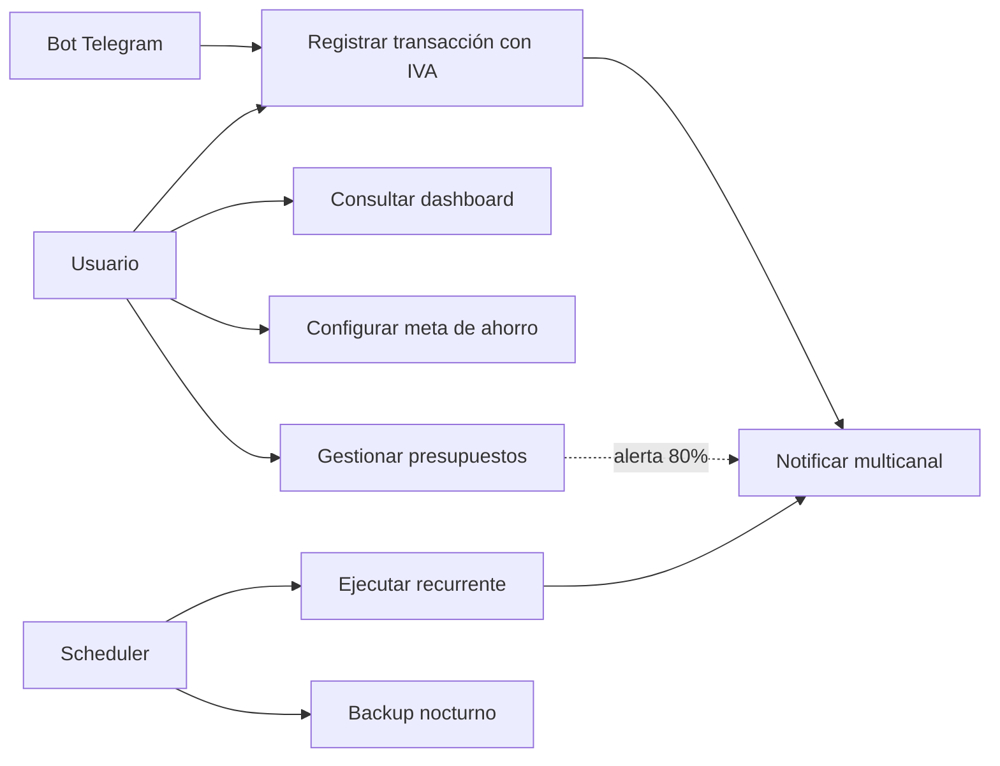

<PresHero
  badge="Acto 3"
  title="Casos de Uso"
  subtitle="4 actores, 10 módulos, y los flujos críticos paso a paso"
/>

## Los actores del sistema

<Reveal>

| Actor | Tipo | Rol |
|-------|------|-----|
| **Usuario**| Humano principal | Registra transacciones, consulta dashboard, gestiona metas y presupuestos |
| **Bot de Telegram**| Sistema interno | Canal conversacional: registro rápido y entrega de alertas |
| **Scheduler (BullMQ)**| Sistema interno | Dispara recurrentes, backups nocturnos y actualización de precios cripto |
| **Servicios externos**| Sistemas externos | CoinGecko, Resend, Firebase, Equifax, Google Drive |

</Reveal>

## Vista general

<Reveal>

</Reveal>

## CU-001 — Registrar transacción con desglose de IVA

Recorre el flujo principal paso a paso:

<UseCaseStepper
  title="CU-001: Registrar Gasto con IVA"
  precondition="Usuario autenticado con JWT válido; al menos una cuenta activa"
  postcondition="Transacción persistida, saldo actualizado atómicamente, jobs de notificación y presupuesto encolados, cache del dashboard invalidada"
  :steps="[
    { actor: 'user', text: 'Abre la app y toca “+ Nueva transacción”, o envía /gasto 25.50 comida al bot de Telegram' },
    { actor: 'system', text: 'Valida el JWT (pipeline preValidation) y el schema TypeBox del payload' },
    { actor: 'system', text: 'Calcula el desglose: monto_neto = 25.50 / 1.15 = $22.17, IVA = $3.33' },
    { actor: 'system', text: 'Verifica fondos: si es tarjeta Diners/Titanium, consulta el cupo consolidado del AccountGroup' },
    { actor: 'system', text: 'Ejecuta BEGIN → INSERT transacción + UPDATE saldo → COMMIT (atomicidad ACID)' },
    { actor: 'system', text: 'Encola jobs en notificationsQueue y budgetQueue (< 1 ms, patrón Observer)' },
    { actor: 'system', text: 'Responde HTTP 201 en menos de 100 ms; el worker procesa las alertas en segundo plano' },
    { actor: 'user', text: 'Recibe push de confirmación; si el presupuesto superó el 80%, también una alerta de Telegram' },
  ]"
/>

## CU-005 — Ejecución de transacción recurrente

<UseCaseStepper
  title="CU-005: Ejecutar Recurrente (Scheduler)"
  precondition="Recurrente en estado Pending o Notified; nextDate ≤ hoy"
  postcondition="Transacción concreta creada; nextDate recalculada; estado → Pending (ciclo continúa) o Executed (terminó)"
  :steps="[
    { actor: 'system', text: 'BullMQ Scheduler detecta que nextDate llegó y encola el job con ID único (idempotencia)' },
    { actor: 'system', text: 'El worker verifica el estado: solo Pending o Notified pueden ejecutarse — cualquier otro lanza InvalidStateException (patrón State)' },
    { actor: 'system', text: 'Crea la transacción concreta derivada de la recurrente, con el mismo flujo ACID de CU-001' },
    { actor: 'system', text: 'Calcula la siguiente ocurrencia según la frecuencia (semanal, mensual, anual)' },
    { actor: 'system', text: 'Si nextDate > endDate: transición a Executed (terminal). Si no: vuelve a Pending' },
    { actor: 'user', text: 'Recibe la notificación: “Se ejecutó tu pago recurrente de Netflix: $7.99”' },
  ]"
/>

## El registro rápido por Telegram, en vivo

<Reveal>

El mismo CU-001 tiene un segundo camino de entrada: sin abrir la app, directo desde el chat:

<TelegramFlowAnim />

</Reveal>

<Reveal>

::: tip Los otros casos de uso documentados
**CU-002** Consultar dashboard (9 widgets, cache 5 min) · **CU-003** Configurar meta de ahorro (aporte mensual necesario + fecha estimada) · **CU-004** Alerta de presupuesto (umbral 80%/100%). El detalle completo está en la [documentación de requerimientos](/requerimientos/overview).
:::

</Reveal>

---

  <a href="./requerimientos">← Requerimientos</a>
  <a href="./arquitectura">Siguiente: Arquitectura →</a>

