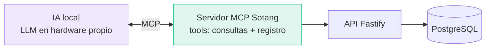

<PresHero
  badge="Acto 10 · Cierre"
  title="Roadmap y Conclusiones"
  subtitle="El estado real del ecosistema, hacia dónde va, y qué demuestra"
/>

## El ecosistema se construye en frentes paralelos

No es un desarrollo secuencial: backend, aplicación móvil, portal de documentación e infraestructura avanzan **en paralelo**, y ya existe un MVP funcional de extremo a extremo.

<TrackBoard :tracks="[
  { name: 'Modelado y Diseño', progress: 100, status: 'Completado', color: '#10b981', detail: 'Requerimientos, casos de uso, UML, arquitectura, métricas CK y análisis formal — las dos entregas académicas.' },
  { name: 'Infraestructura', progress: 80, status: 'Operativa', color: '#10b981', detail: 'Raspberry Pi 5 con K3s en producción local, Cloudflare Tunnel activo con HTTPS público. Pendiente: pipeline CI/CD completo con Helm.' },
  { name: 'Backend API', progress: 45, status: 'MVP funcional', color: '#3b82f6', detail: 'Fastify + Drizzle con las 28 tablas migradas. Auth, cuentas y transacciones respondiendo en producción local. Siguientes: presupuestos, metas, patrimonio.' },
  { name: 'Aplicación Móvil', progress: 40, status: 'MVP funcional', color: '#3b82f6', detail: 'Expo SDK 57 con las 5 pantallas principales conectadas a la API real: login JWT + SecureStore, dashboard, cuentas, transacciones y perfil.' },
  { name: 'Portal de Documentación', progress: 85, status: 'En línea', color: '#10b981', detail: 'Este mismo sitio: VitePress con diagramas Mermaid/PlantUML, arquitectura completa, patrones, métricas y esta presentación interactiva.' },
  { name: 'Bot Conversacional', progress: 10, status: 'Diseñado', color: '#f59e0b', detail: 'Los 8 comandos especificados y el flujo webhook documentado. Implementación arranca al cerrar el módulo de transacciones.' },
]"/>

## Cómo fluye un request en el MVP hoy

<Reveal>

Esto ya funciona de extremo a extremo — de la app móvil, por el túnel de Cloudflare, hasta PostgreSQL en la Raspberry:

<FlowAnim />

</Reveal>

## Visión futura: tus finanzas + IA local vía MCP

<Reveal>

La extensión natural del sistema es exponer un **servidor MCP (Model Context Protocol)** sobre la API, para conectar un modelo de lenguaje **corriendo localmente** en la misma red:

Eso habilita conversaciones como *"¿cuánto gasté en restaurantes este trimestre comparado con el anterior?"* o *"regístrame el gasto de la farmacia"* — con una propiedad que ningún producto comercial puede ofrecer: **la IA y los datos financieros viven en la misma red local; nada sale a la nube**. La arquitectura ya lo permite: el MCP server sería un cliente más de la API existente, con las mismas 6 capas de seguridad.

</Reveal>

## Lo que este proyecto demuestra

<Reveal>

| Afirmación | Evidencia presentada |
|-----------|----------------------|
| Los patrones GoF resuelven problemas **reales**, no académicos | Composite = cupo Diners/Titanium · State = recurrentes sin dobles ejecuciones · Adapter = CBO 4→1 |
| Un diseño se puede **medir** antes de codificar | CK Suite: WMC máx 6, CBO máx 5, LCOM 0, DIT 1 — todo bajo umbral |
| La privacidad total es **viable** con costo cero | 100% de los datos en una Raspberry Pi de $80, hosting $0/mes |
| El análisis formal detecta defectos **antes** de que existan | Sin estados trampa, sin deadlocks, contratos con invariantes ACID |
| Las mejoras salen de los **números**, no de la intuición | 5 técnicas trazables a métricas concretas: V(G) 7→2, CBO 4→1 |
| No es solo diseño: **el MVP existe**| App móvil + API + Raspberry en producción local, documentado en este portal |

</Reveal>

<Reveal>

## En una frase

> **Sotang Finance demuestra que es posible construir un ecosistema financiero personal completo — backend, móvil, documentación y, a futuro, IA local vía MCP — sobre hardware propio de bajo costo, aplicando ingeniería de software con rigor: del requerimiento a la métrica, y de la métrica a la mejora.**

</Reveal>

<Reveal :delay="200">

---

### ¿Preguntas?

Toda la documentación técnica está en este mismo sitio:
[Arquitectura](/arquitectura/overview) · [Patrones](/entrega2/patrones-diseno) · [Métricas](/entrega2/metricas-diseno) · [Análisis Formal](/entrega2/analisis-formal) · [Base de Datos](/base-de-datos/erd)

</Reveal>

---

  <a href="./mejoras">← Mejoras</a>
  <a href="./">Volver a la portada ↺</a>

