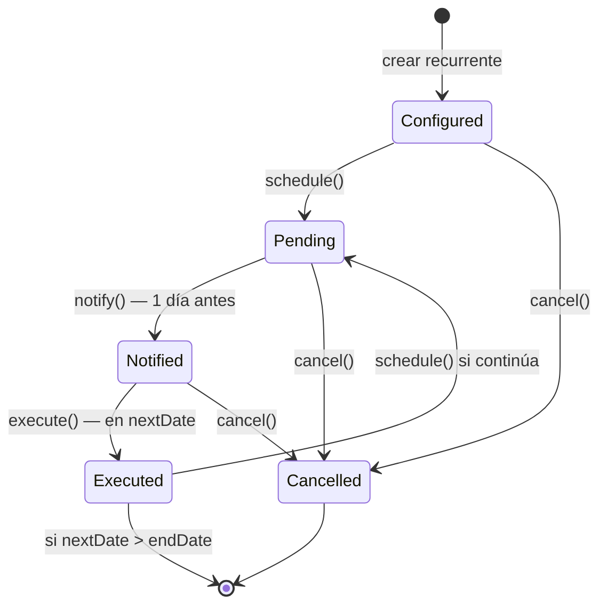

<PresHero
  badge="Acto 6"
  title="Patrones de Diseño"
  subtitle="8 patrones GoF aplicados a problemas reales — no decorativos. Voltea cada tarjeta."
/>

## Los 8 patrones GoF

Cada tarjeta muestra el **problema real** del dominio; haz clic para voltear y ver la **solución**:

<PatternCards :patterns="[
  {
    name: 'Singleton', category: 'Creacional', icon: '01',
    problem: 'Si cada uno de los 12 módulos creara su propio pool de conexiones a PostgreSQL, habría 12 pools simultáneos agotando la RAM de la Raspberry Pi.',
    solution: 'core/db.ts crea el pool UNA sola vez al arrancar y exporta la referencia inmutable. Todos los módulos importan la misma instancia.',
    location: 'core/db.ts'
  },
  {
    name: 'Factory Method', category: 'Creacional', icon: '02',
    problem: '6 tipos de cuenta con comportamientos distintos: bancaria, tarjeta (cupo + fecha de corte), ahorro, efectivo, cripto e inversión. Crear cada una con if/else mezcla responsabilidades.',
    solution: 'AccountFactory.create(dto) encapsula la creación y retorna siempre la interfaz IAccount. El servicio nunca sabe qué tipo concreto maneja.',
    location: 'modules/accounts/account.factory.ts'
  },
  {
    name: 'Decorator', category: 'Estructural', icon: '03',
    problem: 'Verificar el JWT en cada handler de los 12 módulos sería duplicación masiva — y olvidar proteger UNA ruta es una brecha de seguridad.',
    solution: 'El plugin de Fastify envuelve el routing: cualquier ruta declara onRequest: [authenticate] y queda protegida sin tocar su handler.',
    location: 'plugins/auth.ts'
  },
  {
    name: 'Adapter', category: 'Estructural', icon: '04',
    problem: 'Tres proveedores con APIs incompatibles: Resend (email), Firebase (push) y gramMY (Telegram). Cambiar de proveedor implicaría reescribir el worker.',
    solution: 'INotificationProvider define un contrato único. Cada proveedor tiene su Adapter. Cambiar Resend por SendGrid = una clase nueva, cero cambios al worker.',
    location: 'workers/notifications/adapters/'
  },
  {
    name: 'Composite', category: 'Estructural', icon: '05',
    problem: 'Diners y Titanium comparten un cupo de $900: un gasto en una reduce el disponible de la otra. Un modelo plano de cuentas no puede expresarlo.',
    solution: 'AccountGroup contiene las sub-tarjetas y calcula el disponible consolidado: 900 − usado_diners − usado_titanium.',
    location: 'modules/accounts/account-group.ts'
  },
  {
    name: 'Observer', category: 'Comportamiento', icon: '06',
    problem: 'Al registrar una transacción deben reaccionar 3 módulos: notificaciones, alertas de presupuesto y metas. Llamadas directas = acoplamiento fuerte.',
    solution: 'BullMQ como bus de eventos: el servicio encola (Subject), los workers consumen (Observers). Agregar un observer nuevo no toca el servicio.',
    location: 'workers/ + Redis'
  },
  {
    name: 'Strategy', category: 'Comportamiento', icon: '07',
    problem: 'Mobile guarda tokens en SecureStore y los recibe en el body; web necesita Cookie HttpOnly contra XSS. Dos flujos de auth distintos.',
    solution: 'MobileAuthStrategy y WebAuthStrategy implementan IAuthStrategy. AuthService delega según el parámetro client del request.',
    location: 'modules/auth/strategies/'
  },
  {
    name: 'State', category: 'Comportamiento', icon: '08',
    problem: 'Las recurrentes tienen 5 estados con transiciones estrictas. Sin State: cadenas de if(estado === X) dispersas y V(G) ≈ 10.',
    solution: '5 clases de estado implementan IRecurringState. Las transiciones inválidas lanzan InvalidStateException — imposible ejecutar dos veces.',
    location: 'modules/transactions/recurring-state/'
  },
]"/>

## El ciclo de vida que protege el patrón State

<Reveal>

Verificado formalmente: **sin estados trampa** y **sin transiciones contradictorias** (ver [Acto 8](./riesgos)).

</Reveal>

<Reveal>

::: info Detalle con código y diagramas de clases
La implementación TypeScript completa de cada patrón, con sus diagramas PlantUML, está en [Design → GoF Design Patterns](/entrega2/patrones-diseno).
:::

</Reveal>

---

  <a href="./seguridad">← Seguridad</a>
  <a href="./metricas">Siguiente: Métricas →</a>

